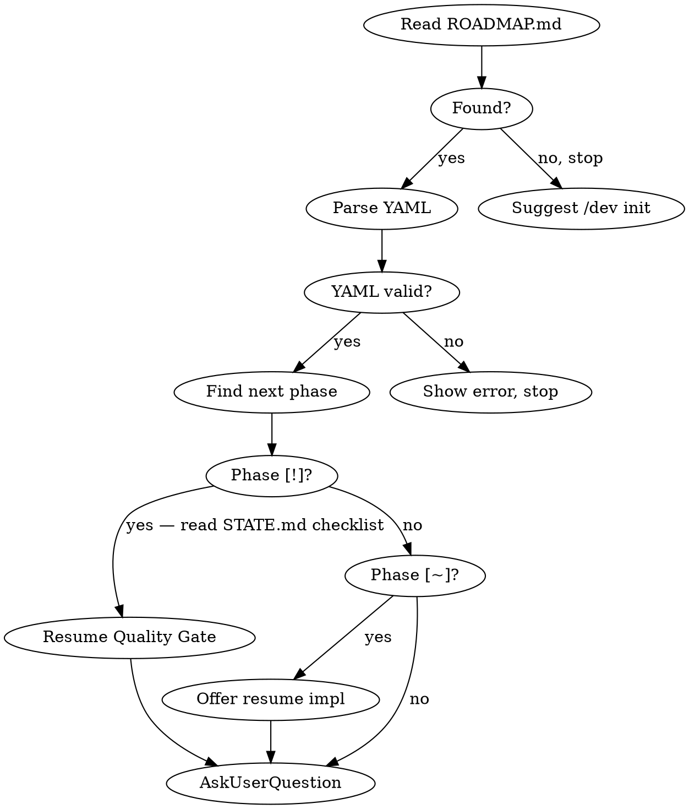
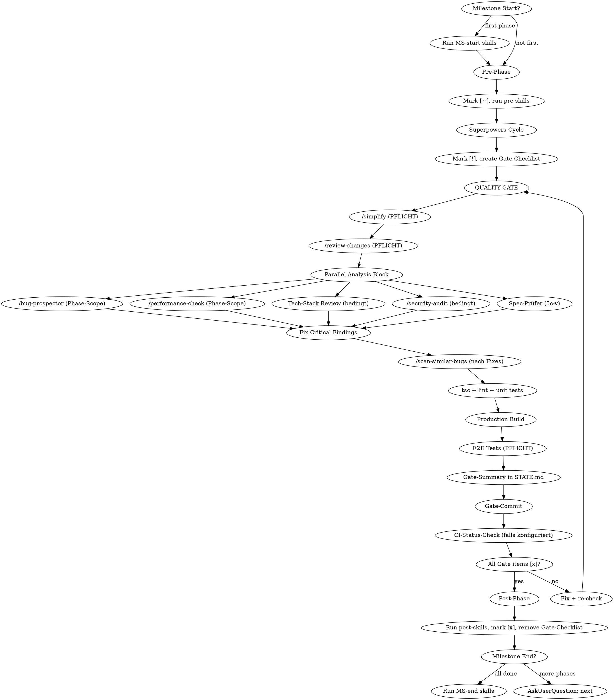
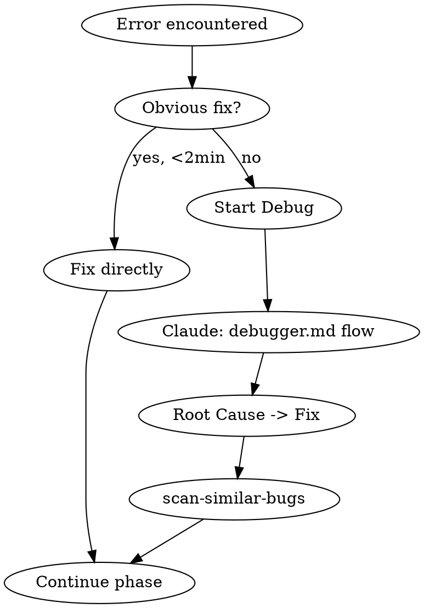

## Language

**IMPORTANT: All user-facing communication MUST be in German (Deutsch).** This includes:
- AskUserQuestion labels, descriptions, and options
- Status summaries and progress reports
- Error messages and warnings
- Commit messages (keep conventional commit prefixes in English, e.g. `roadmap:`, `feat:`)
- STATE.md and ROADMAP.md prose sections

Technical terms (skill names, file paths, YAML keys) stay in English.

---

## Package Manager Detection

Many steps require running project commands (type-check, lint, test). Detect the package manager once per session and reuse:

1. Check for lock files in project root: `pnpm-lock.yaml` → `pnpm`, `bun.lockb` / `bun.lock` → `bun`, `yarn.lock` → `yarn`, `package-lock.json` → `npm`
2. If no lock file: check if `pnpm` / `bun` / `yarn` is available in PATH, fall back to `npm`
3. Store as `$PM` for the session. All commands below use `$PM` as placeholder.

Common commands:
- Type-check: `$PM tsc --noEmit` (or `npx tsc --noEmit` as fallback)
- Lint: `$PM lint` (or `$PM run lint`)
- Unit tests: `$PM test` (or `$PM run test`)
- E2E tests: `$PM test:e2e` (or `$PM run test:e2e`)

---

## Tech-Stack-Aware Skills

Detect the project's tech stack once per session and auto-invoke matching skills at the right points in the lifecycle. Detection runs during Session Start by checking config files and dependencies.

### Detection

| Indikator | Tech Stack | Skills |
|-----------|-----------|--------|
| `next.config.*` or `"next"` in dependencies | **Next.js** | `next-best-practices` |
| `components.json` (shadcn config) | **shadcn/ui** | `shadcn` |
| PostgreSQL connection (`.env` with `DATABASE_URL`, `pg` in deps, migrations dir) | **PostgreSQL** | `pg:design-postgres-tables` |
| `Podfile` / `.xcodeproj` / `Package.swift` | **iOS/macOS** | `swiftui-pro`, `swift-concurrency-pro`, `swift-testing-pro` |
| `*.csproj` with WinUI/WindowsAppSDK | **WinUI** | `winui-pro` |
| `Cargo.toml` or `src-tauri/` directory | **Rust / Tauri** | `rust-best-practices`, `rust-testing`, `tauri-v2` |
| `svelte.config.*` or `"svelte"` in dependencies | **Svelte** | `svelte:svelte-core-bestpractices`, `svelte:svelte-code-writer` (offiziell, + Svelte-MCP) |

Store detected stacks as `$TECH_STACKS` for the session (e.g., `[nextjs, shadcn, postgres]`).

### Where Tech Skills Auto-Trigger

**→ Read `tech-stack-triggers.md` in this skill directory for both trigger matrices.**

Summary: Tech-Skills greifen an zwei Stellen — beim **Brainstorming (4a)** je nach `@type:` und
`$TECH_STACKS`, und im **Gate-Schritt 5c** als read-only Reviews, ausgelöst von den Dateien, die
die Phase tatsächlich geändert hat. Zwei Matrizen: *Tech-Stack Review* (nextjs, shadcn, ui-scan,
postgres, swift, winui, rust, tauri, svelte) und *Security Review* (auth/login/session/middleware,
API-Routen/Actions, DB-Schema, sowie `@type: auth`/`backend`). Kritische Findings → **vor 5d** fixen.

## Subagent-Modell-Wahl

`/dev` dispatcht viele parallele Agent-Subagenten. **Beim Dispatch immer explizit ein Modell angeben** — ein ausgelassenes Modell erbt das teuerste Session-Modell (Erkenntnis aus superpowers 6.x SDD). Wähle das günstigste Tier, das die Aufgabe trägt:

| Rolle | Tier |
|-------|------|
| Read-only Analyse in Step 5c: `/bug-prospector` bzw. `bug-prospector-neutral` (Werkzeug je Stack), `/performance-check`, Tech-Stack Review | **günstiges Tier** |
| `/security-audit` bzw. `/security-review` (Phase- oder Full-Scope), Spec-Prüfer (5c-v) | **Standard/capable Tier** |
| Milestone-End & Pre-Release Full-Scans (`/bug-prospector` full, `/performance-check` full, `/security-audit` full, `/dead-code-scanner` full) | **capable Tier** |

Nur die **Dispatch-Modellwahl** ist betroffen — welche Checks laufen und ihre Trigger bleiben unverändert.

---

## Visual Companion — Pflichtregeln

Der Visual Companion ist ein Browser-basierter Server der HTML-Screens rendert. Er wird **ohne Rückfrage und ohne Erlaubnis** genutzt — er ist fester Bestandteil des Workflows, kein optionales Feature.

### Grundregel: Wann Browser, wann Terminal?

| Inhalt | Medium |
|--------|--------|
| Roadmap-Fortschritt, Phasen-Übersicht, Milestone-Zusammenfassung | **Browser** |
| UI-Layout-Optionen, Designentscheidungen, Wireframes | **Browser** |
| Architektur-Diagramme, Datenfluss, Komponenten-Beziehungen | **Browser** |
| Quality Gate Findings-Dashboard (wenn ≥ 3 Findings) | **Browser** |
| Konzeptuelle Ja/Nein-Fragen ("Resume?", "Weiter?") | **Terminal** |
| Technische Entscheidungen ohne visuelle Dimension | **Terminal** |
| Kurzantworten, Bestätigungen, einzeilige Optionen | **Terminal** |

**Faustregel:** Wenn der Inhalt aus mehr als 3 Zeilen strukturierter Information besteht oder eine räumliche Darstellung hat → Browser. Ausnahme: Fragen ohne UI/UX-Seite (Datenmodell, Bibliothekswahl, Benennung) bleiben im Terminal, auch wenn sie länger sind.

### Pflicht-Trigger in `/dev` — immer, automatisch

| Schritt | Was gezeigt wird | Format |
|---------|-----------------|--------|
| **Session Start** (wenn ≥ 2 Phasen oder Milestone-Wechsel) | Roadmap-Fortschritt: Milestones als Fortschrittsbalken, aktuelle Phase hervorgehoben, Blockers | Baustein „Roadmap" |
| **`/dev status`** | Vollständige Roadmap-Übersicht mit allen Milestones, Phasen, Status-Icons | Baustein „Roadmap" (alle Milestones) |
| **Milestone End Summary** | Was wurde gebaut: Phase-Liste mit Gate-Summary Highlights, nächste Schritte | Baustein „Roadmap" + „Gate-Dashboard" |
| **Quality Gate Summary** (wenn ≥ 3 Findings über alle Checks) | Findings nach Kategorie: kritisch/hinweis, was behoben wurde | Baustein „Gate-Dashboard" |
| **`/dev review` Pre-Release** | Qualitäts-Übersicht über alle Gate-Summaries: Findings-Trend, offene Blocker | Baustein „Gate-Dashboard" (über alle Phasen) |
| **Befragung / Brainstorming — Frage mit UI/UX-Seite** (jede Phasengröße) | Die Optionen als Mockups nebeneinander, je Option die Zustände; Desktop/Mobil und Hell/Dunkel, wo das Projekt beides hat. Antwort per `AskUserQuestion`, Optionen dort gleich benannt | Bausteine „UI-Entscheidung", „Zustandsraster", „Responsive/Dark" |
| **Brainstorming — Lösungsansätze, Architektur-Phase** | Je Ansatz ein Mermaid-Diagramm (Komponenten/Datenfluss) mit Vor- und Nachteilen | Baustein „Architektur-Vergleich" |
| **Brainstorming — Entwurf, Architektur-Phase** | Vorher/Nachher als zwei Diagramme nebeneinander | Baustein „Vorher/Nachher" |

**Wann eine Frage eine UI/UX-Seite hat:** wenn die Antwort sichtbar wird — Layout, Navigation, Ablauf eines Nutzers durch Ansichten, Formular, Rückmeldung (Fehler, Laden, Leer), Darstellung auf Größen und Themes. Nicht: Datenmodell, Bibliothekswahl, Benennung — dann kein Screen, Frage nur im Terminal.

**Aussehen der Screens:** Stilregeln und fertige Bausteine stehen in `companion-screens.md` (in diesem Skill-Verzeichnis).

### Wie der Server gestartet wird

```bash
# Server starten (automatisch, ohne Rückfrage) — über den /dev-Wrapper.
# Der Wrapper resolved die neueste installierte superpowers-Companion und setzt
# den Anzeige-Host selbst: Ist DEV_COMPANION_URL_HOST gesetzt (etwa ein Tailscale-Name),
# lauscht der Server auf allen Schnittstellen und nennt diesen Host, sonst localhost.
~/.claude/skills/dev/scripts/companion.sh --project-dir <project-root>
# Gibt JSON zurück, u.a.:
#   "url":        http://<host>:PORT/?key=<TOKEN>  ← MUSS verbatim verwendet werden
#   "screen_dir": <session>/content  ← hier HTML-Screens hineinschreiben
#   "state_dir":  <session>/state    ← Alive-Check (server-info / server-stopped)
```

- Speichere die zurückgegebene `url` **verbatim** (inkl. `?key=<TOKEN>`), sowie `screen_dir` (Content-Dir für HTML-Screens) und `state_dir` (für Alive-Check) für die Session. `session_dir` = Elternverzeichnis von `state_dir`/`screen_dir` (für den Stop)
- Teile dem User die `url` **exakt so** mit, wie sie zurückkam — niemals rekonstruieren, niemals den Token weglassen, niemals einen anderen Host einsetzen
- Server bleibt die gesamte `/dev`-Session aktiv — nicht bei jedem Schritt neu starten (Auto-Exit erst nach 4 h Idle, `idle_timeout_ms` im Return)
- **Alive-Check** vor jedem HTML-Write: `<state_dir>/server-info` existiert **und** `<state_dir>/server-stopped` fehlt; sonst Neustart mit **gleichem** `--project-dir` (gleicher Port — der offene Browser-Tab reconnectet selbst, keine neue URL nötig)
- **Protokoll-Details** (wie ein Screen geschrieben/aktualisiert wird) siehe superpowers `brainstorming/visual-companion.md` — die dortige, mit superpowers versionierte Guide ist maßgeblich; `/dev` hält nur seine Trigger-Tabelle; Aussehen und Bausteine stehen in `companion-screens.md`

### Screen zeigen — das Verfahren

Alle Pflicht-Trigger oben nutzen dieselbe Abfolge. Wo weiter unten **„Screen zeigen"** steht, ist
genau das gemeint — automatisch, ohne Rückfrage:

1. **Server sicherstellen** — Alive-Check; wenn nicht aktiv, `companion.sh --project-dir <project-root>`
   starten (gleicher `--project-dir` → gleicher Port, ein offener Tab reconnectet selbst).
2. **HTML-Screen schreiben** — Content Fragment mit dem `Write`-Tool in `screen_dir`.
3. **`url` verbatim mitteilen** — exakt wie zurückgegeben, inklusive `?key=<TOKEN>`.
   **Niemals rekonstruieren, niemals einen anderen Host einsetzen.**

Der Screen ist die Bestätigungsfläche: der User erkennt daran unmittelbar, ob der Stand stimmt.
Deshalb zeigt er immer den Zustand **nach** der Änderung, nie den davor.

Wie ein Screen aussieht — Content Fragments, Stilregeln, Bausteine (Roadmap, Gate-Dashboard, Warten u.a.) — steht in `companion-screens.md`.

---

# /dev — Milestone Orchestrator

Manages a project's ROADMAP.md and sequences superpowers cycles for each phase. Delegates all implementation work to existing skills.

## Command Router

| Input | Section |
|-------|---------|
| `/dev` or `/dev next` | Session Start |
| `/dev init` | Roadmap Creation |
| `/dev status` | Status Display |
| `/dev skip` | Skip Phase |
| `/dev add` | Add Phase/Milestone |
| `/dev reorder` | Reorder Phases |
| `/dev review` | Pre-Release Review |
| `/dev debug` | Debug Flow |
| `/dev pause` | Pause Session |
| `/dev check` | Standalone Quality Gate |

## When NOT to Use

- Single-task requests ("fix this bug", "add a button") — use superpowers directly
- Projects without milestones — overkill for small fixes
- When user explicitly asks to skip the orchestrator

---

## Session Start

**Triggered by:** `/dev`, `/dev next`, or automatically when a new session starts and ROADMAP.md exists.



1. **Read ROADMAP.md** from project root. If missing: "No ROADMAP.md found. Run `/dev init` to create one." Stop.
2. **Read STATE.md** from project root. If missing: create it from ROADMAP.md (derive progress, position, session info). If present: use Session Continuity for resume context.
3. **Detect tech stack** — check project root for stack indicators (see Tech-Stack-Aware Skills section). Store as `$TECH_STACKS`. This detection happens ONCE per session and is reused in all subsequent gates.
4. **Parse YAML frontmatter.** If malformed: show error, ask user to fix manually, stop.
5. **Parse phases:** Extract milestones (`##`), goals (`Goal:`), phases (checkbox items), annotations (`@type:`, `@skills:`, `@spec:`, `@plan:`, `@gate:`).
   - States: `[ ]` not started, `[~]` in progress, `[!]` gate pending (implementation done, quality gate outstanding), `[x]` done, `[—]` skipped
6. **Find current position:** First milestone with incomplete phase. If all done: "Roadmap complete!" Offer `/dev add` or `/dev review`.
7. **Show summary** — wenn ≥ 2 Phasen verbleiben oder ein Milestone-Wechsel stattfand: **Screen zeigen** (Verfahren siehe „Visual Companion"). Inhalt: Baustein „Roadmap" (`companion-screens.md`) — Milestone-Blöcke, Fortschrittsbalken, Phase-Status-Icons, Blockers in Rot. Zusätzlich Terminal-Summary:
   ```
   Milestone 2: UI Shell (3/5 phases done)
   Next: Phase 4 — Connections View (@type:ui @gate:fast)
   Tech Stack: [nextjs, shadcn, postgres]
   Pre-skills: [workflow-audit]  Post-skills: [requesting-code-review]
   Blockers: <from STATE.md, if any>
   ```
   Show `@gate:` only if not `full`. Show `$TECH_STACKS` only on first session start or if changed.
   Bei 1 verbleibender Phase oder reinem Einstieg ohne Milestone-Kontext: nur Terminal.
8. **AskUserQuestion** (single-select):
   - **Start next phase (Recommended)** — "Begin Phase N: <name>" (or "Resume Implementation" if `[~]`, or "Resume Quality Gate: nächster Schritt — `[ ] /simplify`" if `[!]` — zeige den ersten offenen `[ ]`-Eintrag aus dem STATE.md Gate-Checklist direkt im Label)
   - **Show full status** — complete roadmap table
   - **Add milestone/phase** — extend roadmap
   - **Skip this phase** — skip with reason
   - **Pre-Release Review starten** — nur anzeigen wenn alle Phasen aller Milestones `[x]` oder `[—]` sind

---

## Status Display

**Triggered by:** `/dev status` or "Show full status"

1. **Read STATE.md** — show Blockers & Risks (if any) and Session Continuity at the top.
2. **Show full roadmap — Screen zeigen** (Verfahren siehe „Visual Companion"). Inhalt: Baustein „Roadmap" (`companion-screens.md`) — alle Milestones, alle Phasen mit Status-Icons, Spec/Plan-Links, Blockers in Rot oben. Zusätzlich Terminal-Kurzform:
   ```
   ### Blockers
   - Windows Dashboard: nur Placeholder

   ### Milestone 1: Foundation (3/3) — Complete
   | # | Phase | Type | Status | Spec | Plan |
   |---|-------|------|--------|------|------|
   | 1 | Database Layer | backend | done | [spec] | [plan] |

   ### Milestone 2: UI Shell (1/3)
   | 1 | Navigation | ui | done | [spec] | [plan] |
   | 2 | Connections View | ui | next | — | — |
   | 3 | Dashboard | ui | pending | — | — |

   ### Requirements: 26/30 complete
   ### Last session: 2026-03-20 — Stopped at: ROADMAP konsolidiert
   ```
3. **Update STATE.md** Session Continuity with current timestamp.

After display: AskUserQuestion with Start/Add/Skip/Done options.

---

## Roadmap Creation

**Triggered by:** `/dev init`

**→ Read `roadmap-creation.md` in this skill directory for the full interactive flow.**

Summary: Interactive AskUserQuestion flow for project goal, phase types, milestone count, skill discovery + security review, trigger configuration, preview + confirm. Creates ROADMAP.md + STATE.md and commits both.

---

## State Tracking (STATE.md)

STATE.md is the project's persistent state file. It tracks progress, requirements, constraints, risks, and session continuity across conversations.

### When to Read STATE.md

- **Every `/dev` and `/dev next` invocation** — read before showing summary
- **`/dev status`** — use STATE.md data for the status display
- **Session start** (when ROADMAP.md exists) — read STATE.md for context

### When to Update STATE.md

| Event | What to Update |
|-------|---------------|
| Phase starts (`[ ]` → `[~]`) | Current Position, Last activity |
| Phase enters gate (`[~]` → `[!]`) | Current Position, Last activity, **create Quality Gate Checklist section** |
| Gate step completes | Check off item in Gate Checklist |
| Gate-Summary geschrieben (5i) | **Append Gate-Summary** unter `### Gate-Summary — Phase N` in STATE.md (permanent — wird nie entfernt) |
| `/dev check` abgeschlossen (5i) | **Append Check-Summary** unter `## Context` in STATE.md (permanent — wird nie entfernt) |
| Phase completes (`[!]` → `[x]`) | Current Position, Progress table, Last activity, **remove Quality Gate Checklist section** |
| Phase skipped (`[ ]` → `[—]`) | Current Position, Progress table, Last activity |
| Milestone completes | Progress table, Next milestone in Current Position |
| Key decision made | Add to Constraints or a Decisions section |
| Blocker discovered | Add to Blockers & Risks |
| Blocker resolved | Remove from Blockers & Risks |
| Session ends (user pauses) | Session Continuity: Last session, Stopped at, Resume hint |
| `/dev init` | Create fresh STATE.md |

### Update Rules

- **Current Position**: OVERWRITE on every phase transition
- **Progress table**: OVERWRITE milestone row when phase count changes
- **Blockers & Risks**: APPEND new, REMOVE resolved
- **Session Continuity**: OVERWRITE on every session pause/end
- **Constraints / Core Value**: IMMUTABLE after init (unless user explicitly changes)

### STATE.md is NOT for

- Detailed plan contents (those go in spec/plan files)
- Code-level decisions (those belong in CLAUDE.md or code comments)
- Debug state (that goes in `.debug/` files)
- Performance metrics or velocity tracking (unnecessary overhead)

**Ausnahme: Gate-Summaries** — diese bleiben dauerhaft in STATE.md. Sie sind kein temporärer Zustand, sondern ein Qualitäts-Wissenslog. Jede Gate-Summary unter `### Gate-Summary — Phase N` wird bei Phase-Completion NICHT entfernt. Nur die `## Quality Gate — Phase N` Checklist-Sektion wird entfernt. Dasselbe gilt für **Check-Summaries** (erstellt von `/dev check`) — auch diese bleiben dauerhaft unter `## Context` erhalten und werden nie entfernt.

---

## Skill Trigger Resolution

1. Read `@type:` from phase (e.g., `ui`)
2. Look up `defaults.phase-types.<type>.pre` and `.post` from frontmatter
3. Apply phase overrides:
   - `@skills:+pre[a]` → append to pre defaults
   - `@skills:+post[a]` → append to post defaults
   - `@skills:pre[a]` (no `+`) → replace pre defaults
   - `@skills:post[a]` (no `+`) → replace post defaults
4. Multiple combine: `@skills:+pre[a] @skills:+post[b]`
5. Unknown type → warn, continue with empty lists

### Built-in Phase Types

| `@type:` | Besonderheit im Quality Gate |
|----------|------------------------------|
| `ui` | Tech-Stack Review shadcn/next-best-practices bedingt aktiv |
| `backend` | Security Audit immer aktiv (auch ohne Auth-Dateien); pg:design-postgres-tables bedingt aktiv |
| `auth` | Security Audit immer aktiv (full scope, nicht Phase-Scope) |
| `security` | Security Audit immer aktiv (full scope); Spec-Prüfer: Akzeptanzkriterien ohne Test sind immer kritisch |
| `refactor` | `/scan-similar-bugs` im full-codebase Modus statt Phase-Scope |
| `data` | pg:design-postgres-tables immer aktiv; Security Audit aktiv |
| `migration` | Spezifische Risiken: Irreversibilität, Datenverlust. Zusätzlich zu `data`-Checks: (1) Security Audit immer aktiv, (2) `/bug-prospector` prüft explizit auf fehlende DOWN-Migration / Rollback-Pfad, (3) E2E-Test muss Migrations-Smoke-Test enthalten (migrate up + verify data + migrate down wenn möglich). `@gate: fast` ist für Migration-Phasen VERBOTEN. |
| `docs` | Rein dokumentarische Phasen (README, API-Docs, Changelog, CLAUDE.md). Minimaler Gate: `/simplify`, `/review-changes`, tsc + lint laufen normal. **Entfallen automatisch:** Security Audit, E2E Tests, Production Build, Spec-Prüfer (5c-v), `/scan-similar-bugs`, `/performance-check`, Tech-Stack Review. `@gate: fast` ist hier semantisch falsch — stattdessen `@type: docs` nutzen. |

### `@gate:` Annotation — Gate-Modus steuern

Phasen können den Gate-Modus über eine `@gate:` Annotation steuern:

| Annotation | Effekt |
|------------|--------|
| `@gate: full` | Standard — alle Schritte laufen (default, muss nicht angegeben werden) |
| `@gate: fast` | Überspringt bedingte Parallel-Checks (Tech-Stack Review, Security Audit, scan-similar-bugs). Pflicht-Schritte (simplify, review-changes, bug-prospector, performance-check, tsc, build, E2E) laufen immer. Für schnelle Iterationsphasen. |
| `@gate: ci-wait` | Fügt expliziten CI-Status-Wait vor `[x]` hinzu, auch wenn CI sonst nicht konfiguriert ist. |

**Wann `@gate: fast` nutzen:** Nur für rein dokumentarische Phasen, Config-Only-Änderungen, oder wenn man bewusst schnell iterieren will. Nie für Phasen mit Auth-, API- oder DB-Änderungen.

**Konflikt-Regel — `@gate: fast` wird automatisch ignoriert bei:**
- `@type: security`, `@type: auth` — Security-Checks sind bei diesen Typen immer Pflicht
- `@type: backend` mit DB-Migrationen — Security Audit bleibt aktiv
- `@type: refactor` — `/scan-similar-bugs` bleibt aktiv im full-codebase Modus, auch bei `@gate: fast`. Refactoring verschiebt Code — das ist genau der Fall wo ähnliche Bug-Pattern woanders auftauchen können. `scan-similar-bugs` ist der einzige BEDINGT-Check der bei Refactor-Phasen trotz `@gate: fast` läuft.
- Wenn geänderte Dateien Auth/API/Migration-Patterns treffen — Security Audit bleibt aktiv unabhängig von `@gate:`

Bei Konflikt: warnen (`"@gate: fast ignoriert — @type:auth erfordert full gate"` / `"@gate: fast: /scan-similar-bugs bleibt aktiv — @type:refactor"`), dann mit dem override fortfahren.

---

## Halt bei Irreversiblem

Quer durch alle Phasenschritte gilt: **bei allem, was `git revert` nicht zurückholt, wird
angehalten und gefragt** — auch mitten in einem autonomen Lauf, auch wenn der Plan den Schritt
vorsieht.

Das Kriterium ist nicht „fühlt sich riskant an", sondern: *wenn das falsch war, bringt ein
Commit-Revert den Zustand zurück?* Lautet die Antwort nein, gehört die Entscheidung dem User:

- Schema- und Datenmigrationen, besonders destruktive (`DROP`, `DELETE`, `TRUNCATE`, Typwechsel)
- jede Änderung an einer **geteilten** Entwicklungs- oder Staging-Datenbank — sie wirkt sofort
  für alle parallelen Sessions, nicht erst beim Merge
- Deploys, Releases, Tags, Force-Pushes, Löschen von Branches
- ausgehende Nachrichten an echte Empfänger (Mail, Push, Webhooks) und Zahlungsvorgänge
- Schreiben in externe Speicher, Registries oder Objektspeicher
- alles, was Secrets, Schlüssel oder Zugangsdaten berührt

Vorgehen: anhalten, in einem Satz sagen was passieren würde und was daran nicht rückholbar ist,
den Vorschlag nennen, freigeben lassen. Bei `@type: migration` ist dieser Halt Pflicht und nicht
durch eine Plan-Zeile ersetzbar — ein Plan, der die Migration beschreibt, ist keine Freigabe,
sie auszuführen.

---

## Phase Execution



### 1. Milestone Start Check

First phase of new milestone → run `defaults.skills.milestone-start` as parallel Agent subagents. Missing skills → warn and skip.

### 2. Pre-Phase

1. Mark phase `[~]` in ROADMAP.md (Edit tool)
2. Resolve pre-skills (see Skill Trigger Resolution)
3. Dispatch pre-skills as parallel Agent subagents

### 3. Pre-Skill → Brainstorming Handoff

If pre-skills produced output files (e.g., `workflow-audit` generates `.workflow-audit/handoff.yaml`), check for these files and pass them as context to brainstorming:
- "The following pre-skill output is available as context: [file path]"
- Read the file and include relevant findings in the brainstorming context

### 4. Superpowers Cycle

**Resume logic:**
- Phase is `[!]` → skip directly to Quality Gate (step 5), read Gate-Checklist from STATE.md to find remaining steps
- Phase is `[~]` with `@plan:` path on disk → skip to execution (4c)
- Phase is `[~]` with `@spec:` path on disk → skip to planning (4b)
- Phase is `[~]` with neither → start from brainstorming (4a); liegt ein freigegebener Chat-Entwurf in STATE.md (kleine Phase), dort weitermachen statt neu zu klären

**4a. Klärung und Brainstorming:**
1. **Einstufen:** architektonisch, wenn die Phase ein neues Projekt oder Teilsystem anlegt, ändert, wie Komponenten zusammenwirken, oder Schnittstellen ändert, auf die andere bauen; `@type: migration` immer. Im Zweifel architektonisch. Bei `@type: docs` keine Befragung.
2. **Architektonisch → Befragung in Runden nach `befragung.md`** (in diesem Skill-Verzeichnis, inkl. ADRs), danach `superpowers:brainstorming` mit dem Übergabe-Hinweis aus `befragung.md`.
3. **Klein → `superpowers:brainstorming`** mit der Vorgabe: jede Frage per `AskUserQuestion`, Empfehlung zuerst mit „(Recommended)"; Fakten selbst nachsehen statt fragen. Den freigegebenen Chat-Entwurf mit Akzeptanzkriterien in STATE.md unter der Phase festhalten — Grundlage für den Spec-Prüfer (5c-v) und für die Wiederaufnahme.

In beiden Fällen: State context: phase name, type, milestone goal, any pre-skill output. Und die Companion-Vorgabe: „Der Visual Companion läuft bereits (URL unten). Biete ihn nicht an, nutze ihn direkt für jede Frage mit UI/UX-Seite und für Architektur-Diagramme; Bausteine in `companion-screens.md` des `/dev`-Skills." Vorher Companion per „Screen zeigen"-Verfahren sicherstellen und die URL mitgeben. Passende Tech-Skills vorher einbinden — siehe `tech-stack-triggers.md`, Abschnitt „During Brainstorming". Brainstorming chains to `superpowers:writing-plans` → `superpowers:subagent-driven-development` internally. After spec produced: add `@spec:` to ROADMAP.md.

**4b. Planning (resume):** Invoke `superpowers:writing-plans`. After plan produced: add `@plan:` to ROADMAP.md.

**4c. Execution (resume):** Invoke `superpowers:subagent-driven-development` with plan path. **Scope-Grenze (wichtig):** SDD führt nur **Tasks implementieren + Per-Task-Reviews** aus, dann **STOPP** — es soll
- **kein** `finishing-a-development-branch` laufen (kein Merge/PR): `/dev` besitzt den Abschluss über sein Quality Gate (Step 5) → Gate-Commit → später `/vision-sync`;
- **keinen** neuen/verschachtelten Worktree anlegen — im **aktuellen** Branch/Worktree arbeiten (MK-Sessions laufen bereits in einem eigenen Worktree; 6.x würde sonst projekt-lokale `.worktrees/` anlegen);
- **keinen** finalen Whole-Branch-Review fahren — `/dev`s Gate (`/review-changes`, `/bug-prospector`, `/security-audit`) deckt das ab.
Diese Grenze beim SDD-Aufruf explizit mitgeben.

**4d. Verification:** Invoke `verification-before-completion`.

**4e. Gate Transition (`[~]` → `[!]`):**
1. Mark phase `[!]` in ROADMAP.md (Edit tool)
2. Create Quality Gate Checklist in STATE.md (see below)
3. Update STATE.md Last activity: "Implementation complete, Quality Gate starting"

The `[!]` status means: implementation is done, but the mandatory Quality Gate has not yet passed. This is the **only** path to `[x]` — a phase MUST go through `[!]` first. Direct `[~]` → `[x]` transitions are **forbidden**.

**Gate-Checklist format** (append to STATE.md):

The checklist is **dynamically generated** at gate entry based on `$TECH_STACKS` and which files were changed. Only include items that will actually run.

```markdown
## Quality Gate — Phase N: <Name>
<!-- @gate: full | fast (default: full) -->

<!-- PFLICHT — immer, auch bei @gate: fast -->
- [ ] /simplify
- [ ] /review-changes
- [ ] /bug-prospector (Phase-Scope)
- [ ] /performance-check (Phase-Scope)
- [ ] Spec-Prüfer (5c-v)                      <!-- gegen @spec:, sonst Chat-Entwurf aus STATE.md -->
<!-- BEDINGT — entfällt bei @gate: fast; weglassen wenn Bedingung nicht erfüllt -->
- [ ] Tech-Stack Review: next-best-practices   <!-- next.config.* geändert -->
- [ ] Tech-Stack Review: shadcn                <!-- components/** mit shadcn-Imports -->
- [ ] Tech-Stack Review: pg:design-postgres-tables  <!-- Migrations/SQL geändert -->
- [ ] Security Audit                           <!-- auth/api/migration geändert ODER @type: backend/auth/security/data -->
- [ ] /scan-similar-bugs                       <!-- entfällt bei @gate: fast -->

<!-- PFLICHT — immer, auch bei @gate: fast -->
- [ ] tsc + lint + tests
- [ ] Production Build
- [ ] E2E Tests

<!-- PFLICHT — immer -->
- [ ] Gate-Summary (STATE.md)
- [ ] Gate-Commit
- [ ] CI-Status-Check                          <!-- nur wenn CI konfiguriert ODER @gate: ci-wait -->
```

**Regeln zur Checklist-Erstellung:**
- Erstelle die Checklist sofort bei `[~]` → `[!]` Transition
- Lese `@gate:` Annotation der Phase — bei `fast`: alle BEDINGT-Einträge weglassen
- **`@type: docs`**: alle BEDINGT-Einträge weglassen + zusätzlich `Production Build`, `E2E Tests` und `Spec-Prüfer (5c-v)` weglassen. Nur `/simplify`, `/review-changes`, `tsc + lint + tests`, `Gate-Summary`, `Gate-Commit` bleiben.
- Lasse bedingte Einträge weg wenn die Bedingung nicht erfüllt ist — nicht `[—]` markieren, einfach weglassen
- Jeder Schritt prüft nach Abschluss seinen Eintrag ab
- **Jeder Haken braucht einen Beleg.** Ein `[x]` wird nur gesetzt, wenn der Schritt gelaufen ist
  UND die entscheidende Ausgabezeile dahinter steht: `- [x] tsc + lint + tests — 0 errors, 412 passed`.
  Kein Beleg → der Haken bleibt offen. „Sieht richtig aus", „müsste durchlaufen" und „habe ich
  vorhin schon geprüft" sind keine Belege.
- **Ein Befehl ohne gelesene Ausgabe ist nicht gelaufen.** Exit-Code 0 genügt nicht, wenn die
  Ausgabe durch eine Pipe (`| tail`, `| head`, `2>/dev/null`) gegangen ist — eine Pipe kann den
  Status der linken Seite verschlucken. Bei Unsicherheit den Befehl ohne Pipe wiederholen.
- **„Erfolg" auf der Gesamtebene belegt die Teilschritte nicht.** Ein grüner CI-Lauf, ein grüner
  Deploy oder ein Werkzeug, das Erfolg meldet, kann Teilschritte übersprungen oder still
  ausgelassen haben. Belegt wird der Schritt, der geprüft wurde — nicht der Rahmen, in dem er lief.
- Wenn Session mid-gate endet: nächste Session liest STATE.md und setzt beim ersten offenen `[ ]` fort
- CI-Status-Check: nur aufnehmen wenn `.github/workflows/` existiert oder `@gate: ci-wait` gesetzt ist

### 5. Mandatory Quality Gate

**PFLICHT — nicht überspringbar, nicht optional. Alle Schritte laufen nach jeder Phase.**

These steps run regardless of `@skills:` configuration — they are hardcoded into the phase lifecycle and cannot be overridden or removed via ROADMAP.md annotations. The phase stays `[!]` until every checklist item is `[x]`.

**5a. /simplify** — modifies code: reviews all changed code for reuse, quality, and efficiency; fixes issues automatically. Muss als erstes laufen, damit `/review-changes` den bereinigten Code sieht.
- After completion: check off `[ ] /simplify` in STATE.md Gate-Checklist.

**5b. /review-changes** — pre-commit review of all changes (after simplify) for bugs, security vulnerabilities, performance issues, and missing tests. Read-only — flags issues, does not auto-fix.
- **Critical issues** (security vulnerabilities, data loss risks, logic errors): fix them before proceeding to 5c.
- **Warnings** (style, minor improvements): note them but proceed — `/simplify` already handled code quality.
- After completion: check off `[ ] /review-changes` in STATE.md Gate-Checklist.

**5c. Parallel Analysis Block** — dispatch the following as **parallel Agent subagents** (all read-only). **Modell explizit setzen** (siehe „Subagent-Modell-Wahl": bug-prospector/performance-check/Tech-Stack → günstiges Tier, security-audit → Standard/capable). Warte auf alle, maximal **15 Minuten**. Wenn ein Subagent nach 15 Minuten noch läuft: abbrechen, dessen Findings als "timeout — übersprungen" markieren, in STATE.md notieren, weiter mit 5d. Ein hängender Analyzer blockiert nicht das gesamte Gate.

**Dispatch-Prompt der Analyzer — zwei Regeln, die über die Trefferquote entscheiden:**
- **Auf Widerlegen prompten, nicht auf Prüfen.** „Finde, was an dieser Änderung falsch ist"
  liefert andere Ergebnisse als „prüfe diese Änderung". Wer nach Bestätigung fragt, bekommt sie.
- **Das Artefakt ohne die eigene Begründung übergeben.** Diff plus die Anforderung, die er
  erfüllen soll — nicht die Überlegung, warum die Lösung richtig ist. Reicht man seine
  Schlussfolgerungen mit, bekommt man deren Bestätigung zurück statt einer Prüfung.

**Umfang und Werkzeug:** Die geänderten Dateien der Phase umfassen auch neue, ungetrackte Dateien (`git ls-files --others --exclude-standard`). Wo unten `/bug-prospector` oder `/security-audit` steht, gilt die Zuordnung **Analyse-Werkzeug je Stack** in `tech-stack-triggers.md`: In Web-, Rust- und gemischten Projekten laufen `bug-prospector-neutral` und `/security-review`.

  **5c-i. /bug-prospector (Phase-Scope)** — analyzes the files changed in this phase through 7 lenses (assumptions, state machines, boundary conditions, data lifecycle, error paths, time-dependent behavior, platform divergence). **Scope:** Only the changed files and their immediate callers/dependencies — NOT the entire codebase.

  **5c-ii. /performance-check (Phase-Scope)** — scans changed files for performance anti-patterns (memory leaks, unnecessary re-renders, N+1 queries, hot-path bloat, missing indexes on new queries, unoptimized data fetching). **Scope:** Only changed files and immediate context.

  **5c-iii. Tech-Stack Review (conditional)** — triggered based on `$TECH_STACKS` and changed files. Trigger-Matrix: `tech-stack-triggers.md`. Skip silently if no relevant files were changed.

  **5c-iv. /security-audit (conditional)** — triggered when changed files touch security-sensitive areas. Trigger-Matrix: `tech-stack-triggers.md`. Skip if no security-sensitive files were changed.

  **5c-v. Spec-Prüfer** — read-only, auf Widerlegen geprompt; bekommt den Diff (inkl. ungetrackter Dateien) und die Spec aus `@spec:`, **ohne** die Begründung der Umsetzung. Meldet, jeweils mit Zitat der Spec-Zeile: (a) verlangt, aber fehlend oder nur teilweise umgesetzt; (b) umgesetzt, aber nicht verlangt; (c) umgesetzt, aber vermutlich falsch; (d) Akzeptanzkriterium ohne Test. (a), (c) und (d) sind kritisch, (b) ein Hinweis; bei `@type: security` ist (d) immer kritisch. Für (d): den Test schreiben und **einmal rot sehen** — die geprüfte Stelle kurz brechen, Test rot, Stelle wiederherstellen, Test grün; Aufruf und Ergebnis als Beleg in die Checkliste. Ohne `@spec:` (kleine Phase, Entwurf nur im Chat) prüft er gegen den freigegebenen Chat-Entwurf mit Akzeptanzkriterien aus STATE.md, ersatzweise gegen die Phasenbeschreibung in der ROADMAP; gibt es beides nicht, entfällt er mit Vermerk „keine Spec".

**After all parallel agents complete:**
- Collect all findings. Separate critical from non-critical.
- **Critical findings** (logic errors, data corruption, race conditions, memory leaks, N+1 in loops, missing DB indexes, security vulnerabilities, auth bypasses): fix ALL before proceeding to 5d.
- **Non-critical findings** (edge cases, optimization suggestions, style hints): note in STATE.md Blockers & Risks, proceed.
- After completion: check off all applicable `[ ]` items in STATE.md Gate-Checklist.

**5d. /scan-similar-bugs** — after any fixes from the parallel block: scan the broader codebase for the same patterns that were just fixed. Prevents regression of the same class of bug elsewhere. Scope: full codebase, but focused on patterns found in 5c.
- Findings: fix automatically where straightforward, note complex ones in STATE.md.
- After completion: check off `[ ] /scan-similar-bugs` in STATE.md Gate-Checklist.

**5e. Verification + Unit Tests** — after all fixes from 5a–5d:
1. Re-run `$PM tsc --noEmit` and `$PM lint` to confirm no regressions.
2. Run unit/integration tests: `$PM test` (or equivalent). If the project has a `test` script in `package.json`, `Makefile`, or similar — run it. For native projects: use `/run-tests`.
3. All three must be green before proceeding. Fix failures before moving on.
- After completion: check off `[ ] tsc + lint + tests` in STATE.md Gate-Checklist.

**5f. Production Build** — verify the project builds successfully. `tsc --noEmit` checks types but misses build-time errors (Server/Client boundaries, dynamic imports, bundler issues, asset resolution, etc.).

Detect build command by technology:

| Technologie | Build-Befehl |
|-------------|-------------|
| Next.js | `$PM next build` (or `$PM build` if mapped in package.json) |
| Vite / React / Vue | `$PM build` |
| .NET / WinUI | `dotnet build` |
| Swift / iOS / macOS | `xcodebuild build` (via `/using-xcode-cli`) |
| Go | `go build ./...` |
| Rust | `cargo build` |
| Library (npm) | `$PM build` if build script exists |

Detection: Check `package.json` `scripts.build`, `Makefile`, `.csproj`, `Package.swift`, `Cargo.toml`, `go.mod` — use the first match.

If no build command exists (e.g., pure script project): skip, no warning needed.

Build must succeed before E2E tests. Fix build errors before proceeding.
- After completion: check off `[ ] Production Build` in STATE.md Gate-Checklist.

**5g. E2E / Integration Tests** — run automated end-to-end tests against the changed areas.

**→ Read `e2e-testing.md` in this skill directory for the full decision matrix and execution steps.**

Summary: Determine testability by tech stack, detect existing infrastructure (Playwright/Cypress/Vitest/XCTest/xUnit), run matching specs, generate smoke tests for new features without specs. Test fails from phase changes must be fixed; pre-existing/flaky failures are documented in STATE.md.
- After completion: check off `[ ] E2E Tests` in STATE.md Gate-Checklist.

**5h. entfällt** (seit 25.09.2026) — Test-Lücken meldet der Spec-Prüfer (5c-v, Punkt d); nachträglich erzeugte Tests lesen den Code ab und sind vom ersten Lauf an grün.

**5i. Gate-Summary** — schreibe eine kompakte 3-Zeilen-Zusammenfassung des Gates in STATE.md als eigenen Abschnitt **unterhalb** der Phase-Completion-Info. Format:

```markdown
### Gate-Summary — Phase N: <Name>
- Gefunden: <N kritische + M Hinweise> (simplify: X Fixes, bug-prospector: Y Findings, security: W Findings)
- Behoben: <was fixiert wurde, in einem Satz>
- Tests: <Spec-Prüfer N Lücken, Tests rot→grün belegt | keine Lücken>
```

Dies baut über Phasen hinweg ein Qualitäts-Wissenslog auf und macht cross-phase Muster sichtbar. Die Summary bleibt in STATE.md dauerhaft erhalten (wird nicht bei Phase-Completion entfernt wie die Checklist).
- After completion: check off `[ ] Gate-Summary (STATE.md)` in STATE.md Gate-Checklist.

**5j. Gate-Commit** — once ALL checklist items are `[x]`: create an atomic commit that captures the gate-verified state. This commit is the canonical "this phase passed QA" snapshot.
- Commit message: `chore: quality gate — Phase N <name> [gate-pass]`
- **Vor dem Commit: Baseline prüfen.** `git branch --show-current` und `git status --porcelain`
  lesen. Der Commit umfasst ausschließlich die Dateien dieser Phase.
  - Falscher Branch → STOPP, nicht committen, den User fragen.
  - Änderungen an Dateien, die diese Phase nicht angefasst hat (parallele Session im geteilten
    Working-Tree, Werkzeuge die Dateien beim Start neu schreiben) → diese Dateien **nicht** stagen.
    Niemals `git add -A` oder `git add .`; die Pfade der Phase explizit stagen.
  - Bleibt unklar, ob eine Änderung zur Phase gehört → fragen, nicht einsortieren. Ein
    Gate-Commit, der fremde Arbeit einsammelt, ist als Rollback-Punkt wertlos und zieht eine
    unbeteiligte Session in die Phase hinein.
- This commit happens **before** post-phase skills run, so the clean state is preserved regardless of what post-skills produce.
- After commit: check off `[ ] Gate-Commit` in STATE.md Gate-Checklist.

**5k. CI-Status-Check (conditional)** — prüft den CI-Status des Gate-Commits. Triggert wenn:
- `.github/workflows/` im Projekt vorhanden ist, ODER
- `@gate: ci-wait` gesetzt ist

Wenn CI konfiguriert: warte auf CI-Completion via `gh run watch` oder `gh run list --branch <branch>`. Timeout: 10 Minuten. Bei CI-Failure: zeige Logs, repariere, erstelle neuen Gate-Commit. Erst nach grünem CI darf `[x]` gesetzt werden.

Wenn kein CI: überspringen, Checklist-Eintrag weglassen.
- After completion: check off `[ ] CI-Status-Check` in STATE.md Gate-Checklist.

### 6. Post-Phase

**Pre-condition:** All items in the STATE.md Gate-Checklist must be `[x]`. If any are unchecked, return to the first unchecked step and complete it. Do NOT proceed to Post-Phase with an incomplete checklist.

Dispatch post-skills as Agent subagents. **Parallelization:** Read-only analysis skills run in parallel. Skills needing final code state run after analysis completes.

**Note:** `/simplify`, `/review-changes`, `/bug-prospector`, `/performance-check`, `/security-audit`, `/scan-similar-bugs`, Spec-Prüfer, `/ui-scan`, build verification, unit tests, and E2E tests have already run in step 5. Do not run them again as post-skills even if listed in `@skills:post[]`.

**Gate-Commit ist bereits erfolgt** — post-skills laufen auf dem gate-verifizierten Code-Stand.

### 7. Phase Completion (`[!]` → `[x]`)

1. **Verify Gate-Checklist:** Read STATE.md, confirm ALL Quality Gate items are `[x]`. If any unchecked → STOP, return to first unchecked step 5.
2. **Verify CI (if applicable):** If CI-Status-Check in checklist — confirm it is `[x]` (green). If not → wait or fix CI first.
3. Mark `[x]` in ROADMAP.md (replacing `[!]`), ensure `@spec:` and `@plan:` present
4. **Remove Gate-Checklist** from STATE.md (the `## Quality Gate — Phase N` section). **Gate-Summary bleibt erhalten.**
5. **Update STATE.md**: Current Position, Progress table, Last activity
6. Commit: `roadmap: complete Phase N — <name>`
7. All phases done in milestone? → Milestone End

### 8. Next Action

AskUserQuestion: Start next phase (Recommended), Pause, Review milestone.

---

## Milestone End

All phases `[x]` or `[—]`:

1. **Run `defaults.skills.milestone-end`** as parallel agents (if configured).
2. **Mandatory Parallel Block** — dispatch as parallel Agent subagents (**Modell explizit: capable Tier für Full-Scans**, siehe „Subagent-Modell-Wahl"), wait for all to complete:
   - **`/bug-prospector`** (full mode, Werkzeug je Stack) — deep analysis of the entire milestone scope through all 7 lenses.
   - **`/performance-check`** (full mode) — comprehensive performance anti-pattern scan across the milestone's changes.
   - **`/security-audit`** (full mode, Werkzeug je Stack) — vollständiger Security-Scan des gesamten Milestone-Scopes. Auch wenn jede Phase bereits bedingte Security Audits hatte, deckt der Full-Mode übergreifende Angriffsflächen auf (Zusammenspiel mehrerer Komponenten, kumulierte Risiken).
   - Critical findings from all three: fix before proceeding.
   - Non-critical findings: note in STATE.md under Blockers & Risks.
3. **Mandatory: `/dead-code-scanner`** (quick mode) — scans for unused code accumulated across the milestone's phases. Hardcoded, runs regardless of configuration.
   - If dead code is found: show findings, fix automatically where safe (unused imports, unreferenced functions), ask for confirmation on larger removals.
4. Re-run `$PM tsc --noEmit` and `$PM lint` after any fixes from steps 2–3.
5. **Update STATE.md** (Progress table, Current Position to next milestone).
6. **Show summary — Screen zeigen** (Verfahren siehe „Visual Companion"). Inhalt: Bausteine „Roadmap" + „Gate-Dashboard" (`companion-screens.md`) — abgeschlossene Phasen mit Gate-Summary-Highlights (kritische Findings/Fixes), nächste Schritte, Milestone-Name + Ziel prominent oben.
7. AskUserQuestion: Next milestone (Recommended), Pre-release review (if configured), Pause.

---

## Phase Interruption

**Triggered by:** User says "lass das", "mach was anderes", "stopp", "abbrechen" or similar during an active `[~]` or `[!]` phase.

**Behavior:**
1. **Stop current work immediately.** Do not continue the current skill invocation.
2. **AskUserQuestion** (single-select):
   - **Phase pausieren** (Recommended) — save progress in STATE.md, keep phase `[~]`/`[!]`, resume later with `/dev next`
   - **Phase überspringen** — mark `[—]` with reason, move to next phase
   - **Anderes tun** — pause via STATE.md, then handle the user's new request outside `/dev`
3. For "Phase pausieren" and "Anderes tun": update STATE.md Session Continuity with what was in progress (e.g., "Phase 3 — unterbrochen nach brainstorming, Plan steht noch aus").
4. For "Anderes tun": do NOT automatically resume the phase after the side task — the user must explicitly say `/dev` or `/dev next` to resume.

**Key rule:** Interruptions preserve state. No work is lost. The `[~]`/`[!]` status and any Gate-Checklist items already checked remain intact.

---

## Pause Session

**Triggered by:** `/dev pause`

Explicitly saves session state for clean handoff to next conversation.

1. **Update STATE.md** Session Continuity:
   - `Last session`: today's date
   - `Stopped at`: current phase name + what was in progress (e.g., "Phase 6 Dashboard — brainstorming complete, plan pending")
   - `Resume`: specific next action (e.g., "`/dev next` to continue planning Phase 6")
2. **Visual Companion aufräumen** (falls Server aktiv):
   - Waiting Screen pushen: `<div style="display:flex;align-items:center;justify-content:center;min-height:60vh"><p class="subtitle">Session pausiert — weiter mit /dev</p></div>`
   - Danach Server stoppen: `~/.claude/skills/dev/scripts/companion-stop.sh <session_dir>`
3. Show confirmation: "Session saved. Next time, run `/dev` to resume."

---

## Debug Flow

**Triggered by:**
- `/dev debug` or `/dev debug <description>` — explicit user request
- User says "fix crash", "why is this broken", "not working", "find bug"
- **Automatically during Phase Execution** when:
  - Build fails and the error is not a simple typo or missing import (i.e., requires investigation)
  - Tests fail after implementation and the cause is not immediately obvious
  - App crashes during `build-and-run`
  - A verification step reveals unexpected behavior

**When NOT to use debug flow:**
- Compiler error with obvious fix (missing semicolon, typo, wrong type) → just fix it
- Build failure due to missing dependency → just add it
- Test fails because test expectations need updating → just update
- If the fix is obvious within 2 minutes, skip the debug flow



Read and follow `debugger.md` in this skill directory for the Claude-side flow. It implements scientific debugging with persistent state files in `.debug/`, a knowledge base that learns from past bugs, and session resume capability.

Key integration points:
- Debug files record which `/dev` phase was active (if any)
- After fix: `scan-similar-bugs` runs automatically
- After archive: returns to the `[~]` phase if one was in progress
- Knowledge base (`.debug/knowledge-base.md`) accelerates future debugging

---

## Skip Phase

**Triggered by:** `/dev skip`

1. Show phase to skip. AskUserQuestion: Skip with reason (Other for free text), Cancel.
2. Update ROADMAP.md: `[—]` + `<!-- skipped: <reason> -->`
3. **Update STATE.md**: Current Position, Progress table, Last activity.
4. Commit.
5. **Screen zeigen** — aktualisierte Roadmap (Baustein „Roadmap" in `companion-screens.md`), die übersprungene Phase mit `[—]`-Icon und Grund markiert.
6. Return to Session Start.

---

## Add Phase/Milestone

**Triggered by:** `/dev add`

AskUserQuestion: Add phase (Recommended) or Add milestone.

**Phase:** Which milestone → name → type → position (end or after specific phase) → extra skills → Edit ROADMAP.md → commit.
**Milestone:** Name/goal → phases → append to ROADMAP.md → commit.

Nach dem Commit: **Screen zeigen** — aktualisierte Roadmap (Baustein „Roadmap" in `companion-screens.md`), die neue Phase/Milestone mit Badge „neu" hervorgehoben.

Warn if adding to a completed milestone.

---

## Reorder Phases

**Triggered by:** `/dev reorder`

Only `[ ]` phases can move. `[x]`, `[!]`, `[~]`, `[—]` stay. If <2 movable: "Nothing to reorder." AskUserQuestion: which phase → which position → Edit → commit.

Nach dem Commit: **Screen zeigen** — aktualisierte Roadmap (Baustein „Roadmap" in `companion-screens.md`), die verschobene Phase mit Badge „verschoben" in ihrer neuen Position.

---

## Pre-Release Review

**Triggered by:** `/dev review`

1. **Mandatory Parallel Block** — dispatch as parallel Agent subagents (**Modell explizit: capable Tier**, siehe „Subagent-Modell-Wahl"):
   - **`/bug-prospector`** (full mode, Werkzeug je Stack) — entire codebase, 7 lenses.
   - **`/performance-check`** (full mode) — entire codebase.
   - **`/security-audit`** (full mode, Werkzeug je Stack) — entire codebase. Kritisch — muss vor Release grün sein.
   - Critical findings from all three: fix before proceeding. Non-critical: note in STATE.md.
2. **Mandatory: `/dead-code-scanner`** (full mode) — comprehensive scan of the entire codebase. Fix findings, then re-run `$PM tsc --noEmit` + `$PM lint`.
3. **Gate-Summary lesen** — lies alle `### Gate-Summary` Einträge aus STATE.md. Wenn keine vorhanden (erstes Release oder frisches Projekt): Hinweis ausgeben "Keine Gate-History verfügbar — dies ist die erste Release", Schritt überspringen. Wenn vorhanden: zeige ein konsolidiertes Qualitätsbild: welche Findings wurden über alle Phasen gefunden und behoben? Gibt es wiederkehrende Muster?
4. Read `defaults.skills.pre-release`. Run each configured skill **sequentially** (each may change code):
   - Dispatch Agent subagent → wait → show summary → AskUserQuestion: Continue (Recommended) or Pause
5. Final summary after all skills.

---

## Standalone Quality Gate

**Triggered by:** `/dev check`

**→ Read `dev-check.md` in this skill directory for the full flow.**

Summary: Precondition ist **keine aktive Phase** (`[~]`/`[!]` → stop, Hinweis auf `/dev next`).
Snapshot der geänderten Dateien als unveränderliches `$CHECK_SCOPE`, dann dieselben Schritte
5a–5k wie das Phasen-Gate gegen diesen Scope, Check-Summary in STATE.md, Check-Commit
`chore: dev check [gate-pass]`.

## Error Handling

| Scenario | Behavior |
|----------|----------|
| ROADMAP.md missing | Suggest `/dev init`. Stop. |
| YAML malformed | Show error. Stop. |
| Unknown `@type:` | Warn, continue with empty skill lists. |
| Skill not installed | Warn, skip, continue. |
| Phase `[!]` found | Resume Quality Gate — read STATE.md checklist, continue from first unchecked item. |
| Phase `[~]` found | Offer resume via spec/plan file detection. |
| Phase `[—]` found | Skip in sequencing, show reason on status. |
| All phases done in MS | Auto-trigger Milestone End. |
| All milestones done | "Roadmap complete!" Offer add/review. |
| `@skills` parse error | Warn, use defaults. |
| `@gate: fast` + `@type: security/auth` | Warn: "`@gate: fast` ignoriert — @type erfordert full gate". Weiter mit `full`. |
| `@gate: fast` + `@type: refactor` | Warn: "`@gate: fast`: `/scan-similar-bugs` bleibt aktiv — @type:refactor". Nur dieser eine Check bleibt, Rest wie `fast`. |
| `@gate: fast` + `@type: migration` | Warn: "`@gate: fast` ignoriert — @type:migration erfordert immer full gate". Weiter mit `full`. |
| `@gate: fast` + Auth/API-Dateien geändert | Warn: "Security Audit trotz @gate:fast aktiv — sicherheitsrelevante Dateien geändert." |
| `@gate:` unbekannter Wert | Warn, fallback auf `full`. |
| `/dev check` mit aktiver Phase `[~]`/`[!]` | Warn: "Phase N noch aktiv. Nutze `/dev next`." Stop. |
| `/dev check` + leerer `$CHECK_SCOPE` + Nein | Kein Fehler — User hat abgebrochen. Stop ohne Aktion. |
| `/dev check` + Schritt schlägt fehl | Stop bei dem Schritt, kein Check-Commit. |

**Principle:** Never block for recoverable errors. Warn and continue. Only stop for missing ROADMAP.md or broken YAML.

---

## Rationalisierungen — die Ausreden, mit denen das Gate umgangen wird

Common Mistakes (unten) listet Konfigurationsfehler. Diese Tabelle listet den anderen
Ausfallpfad: den Satz, mit dem sich ein Pflichtschritt gerade selbst wegargumentiert. Taucht
einer dieser Gedanken auf, ist das das Signal, den Schritt **zu machen** — nicht ihn zu begründen.

| Gedanke | Wirklichkeit |
|---------|--------------|
| „Die Phase ist zu klein für das volle Gate" | Größe sagt nichts über Blast Radius. Eine Zeile in einem Auth-Pfad wiegt mehr als 300 Zeilen Markup. Die einzige legitime Verkleinerung ist `@gate: fast` — und die hängt an `@type:`, nicht am Gefühl. |
| „Der Analyzer hing, überspringen wir ihn" | Der 15-Minuten-Timeout in 5c ist für **einen** hängenden Subagenten gedacht, nicht als Abkürzung. Timeout heißt: als „timeout — übersprungen" in STATE.md notieren, damit die Lücke sichtbar bleibt. Zwei Timeouts im selben Gate sind ein Befund, kein Betriebsgeräusch. |
| „tsc ist grün, der Build läuft schon durch" | Genau deshalb ist 5f ein eigener Schritt: `tsc` sieht keine Bundler-Fehler, keine Server/Client-Grenzen, keine Asset-Auflösung. Der Build ist der Test, nicht die Vermutung. |
| „Die Tests sind vorhin schon gelaufen" | Vorhin war vor `/simplify`, vor den Fixes aus 5c und vor 5d — jeder davon verändert Code. 5e läuft **nach** allen Fixes, sonst belegt es den falschen Stand. |
| „Der Fehler war vorher auch schon da" | Kann sein — dann gehört er dokumentiert (STATE.md, Blockers & Risks), nicht stillschweigend übergangen. Undokumentiert ist er beim nächsten Lauf deine eigene Regression. |
| „Ich weiß, was der Check finden würde" | Dann kostet er nichts. Ein Check, dessen Ergebnis man vorhersagt, ist der billigste — und der, bei dem die Vorhersage am häufigsten falsch ist. |
| „Der User will schnell fertig werden" | Der User will einen fertigen Stand, nicht einen, der fertig aussieht. Tempo-Wünsche verkleinern das Gate nicht; wer es verkleinern will, sagt es ausdrücklich und wählt `@gate: fast` oder ein passendes `@type:`. |
| „Haken setzen, den Beleg schreibe ich nachher" | Nachher ist der Kontext weg und der Haken steht. Beleg und Haken entstehen zusammen oder keines von beiden. |
| „Der Plan sagt, ich soll die Migration ausführen" | Ein Plan beschreibt, er genehmigt nicht. Irreversibles braucht die Freigabe des Users — siehe „Halt bei Irreversiblem". |

---

## Common Mistakes

| Mistake | Fix |
|---------|-----|
| Putting code-modifying skills (safe-refactor) as automatic pre-phase triggers | Use on-demand only — too heavy for every phase start |
| Adding web-only skills (playwright-cli) to native app projects | Match skills to project type during `/dev init` |
| Running all post-skills sequentially | Most are read-only — run in parallel for speed |
| Editing ROADMAP.md manually without updating annotations | Use `/dev add`, `/dev skip`, `/dev reorder` instead |
| Skipping milestone-start skills to "save time" | They establish baselines — run them, especially tech-talk-reportcard |
| Nutzen von `@gate: fast` für Auth/API/DB-Phasen | `@gate: fast` deaktiviert Security Audit — nur für Docs/Config nutzen |
| Gate-Summary aus STATE.md löschen | Die Summary ist permanent — nur Gate-Checklist wird nach [x] entfernt |
| Phase direkt `[~]` → `[x]` ohne Gate | VERBOTEN — immer `[!]` dazwischen. Der Gate ist nicht optional |
| CI-Status ignorieren und trotzdem `[x]` setzen | Wenn CI konfiguriert: Gate ist erst grün wenn CI grün ist |
| Test-Lücke aus dem Spec-Prüfer übergehen "weil die Phase klein ist" | Jedes Akzeptanzkriterium braucht einen Test, der einmal rot war — Größe ist kein Argument |
| `@type: migration` als `@type: data` oder `@type: backend` anlegen | Migration hat eigene Risiken (Rollback, Irreversibilität) — immer `@type: migration` verwenden für Phasen die Datenbankmigrationen beinhalten |
| `@gate: fast` für Migration-Phasen setzen | Explizit verboten — `@type: migration` erzwingt immer full gate |
| SDD in 4c den Branch „finishen" / mergen lassen | SDD nur implement + per-task-review; Abschluss besitzt `/dev` (Gate → Gate-Commit → `/vision-sync`). Kein `finishing-a-development-branch`, kein neuer Worktree, kein finaler Whole-Branch-Review |
