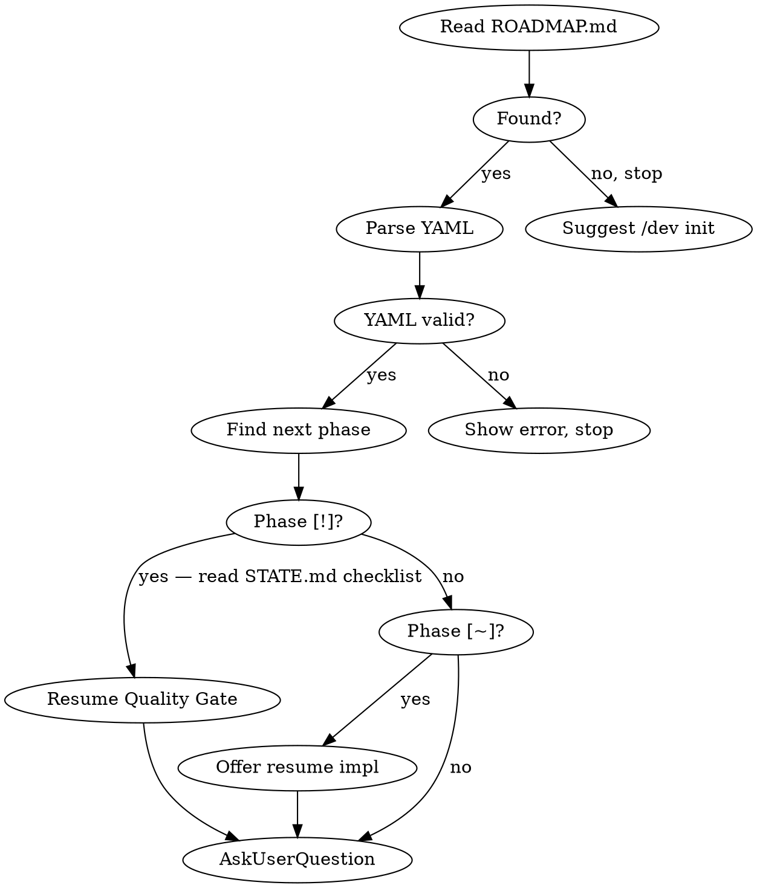

## Language

**IMPORTANT: All user-facing communication MUST be in the user's language** — the language the user writes in, or the language their instructions specify. This includes:
- AskUserQuestion labels, descriptions, and options
- Status summaries and progress reports
- Error messages and warnings
- Commit message bodies (keep conventional commit prefixes in English, e.g. `roadmap:`, `feat:`)
- STATE.md and ROADMAP.md prose sections

Technical terms, skill names, file paths, YAML keys and conventional-commit prefixes stay in English.

---

---

# /dev — Milestone Orchestrator

Manages a project's ROADMAP.md and sequences superpowers cycles for each phase. Delegates all implementation work to existing skills.

## Command Router

| Input | Section | Read |
|-------|---------|------|
| `/dev` or `/dev next` | Session Start | this file |
| `/dev init` | Roadmap Creation | `roadmap-creation.md` |
| `/dev status` | Status Display | `commands.md` |
| `/dev skip` | Skip Phase | `commands.md` |
| `/dev add` | Add Phase/Milestone | `commands.md` |
| `/dev reorder` | Reorder Phases | `commands.md` |
| `/dev review` | Pre-Release Review | `commands.md` |
| `/dev debug` | Debug Flow | `commands.md` → `debugger.md` |
| `/dev pause` | Pause Session | `commands.md` |
| `/dev check` | Standalone Quality Gate | `dev-check.md` → `gate.md` |
| `/dev ui [scope]` | UI review and rework | `ui-review.md` |
| `/dev updates` | Decide on held-back skill updates | `updates.md` → `sources.md` |

## When NOT to Use

- Single-task requests ("fix this bug", "add a button") — use superpowers directly
- Projects without milestones — overkill for small fixes
- When user explicitly asks to skip the orchestrator

---

---

## Files of This Skill

`$DEV_DIR` is the directory of this `SKILL.md`; all paths below are relative to it. Load only what
the current step needs.

| File | Holds | Read when |
|---|---|---|
| `gate.md` | Quality gate 5a–5k, checklist, phase types, `@gate:`, project commands per stack | Gate entry, resuming `[!]`, `/dev check` |
| `commands.md` | Status, skip, add, reorder, pause, debug, milestone end, pre-release review | The router points there; Milestone End (step 7); build/tests fail without obvious cause (Debug Flow) |
| `models.md` | Which model tier each subagent gets | Before dispatching subagents |
| `state.md` | What STATE.md holds and when each part changes | Before writing STATE.md |
| `companion.md` | Visual Companion: when browser vs terminal, mandatory triggers, server start, "Show screen" | Before the first screen of a session |
| `companion-screens.md` | Look and building blocks of the screens | When writing a screen |
| `runtime.md` | Host adapter: `$DEV_DIR`, tool names as capabilities, Codex vs Claude Code | Once per session, at the first explicit `/dev` run (not for the automatic one-line status) |
| `superpowers.md` | Which superpowers install is active, static check, update path (prepares only) | Session start before the first phase step; before any plugin update |
| `befragung.md` | Interview in rounds for architectural phases, ADRs | Step 4a, architectural phase |
| `tech-stack-triggers.md` | Which tech, design and security sources fire when | Steps 4a, 4c and gate step 5c |
| `roadmap-creation.md`, `dev-check.md`, `e2e-testing.md`, `debugger.md` | One flow each | As named in the router or gate |
| `stack/INDEX.md`, `stack/docs.md` | Stack detection; which stack source or bundled docs load on which trigger; live-docs source per technology | Detection once per session (section 1); otherwise only via `tech-stack-triggers.md` — then only the matching rows |
| `design/INDEX.md` | Which design guideline or source loads on which trigger | Only via `tech-stack-triggers.md`, `ui-review.md`, companion building block "UI decision" — then only the matching rows |
| `analyzers/CONTRACT.md` | How each analyzer subagent is dispatched and reports | With every analyzer dispatch (gate 5b–5d, Milestone End, Pre-Release Review, `/dev ui`) |
| `ui-review.md` | `/dev ui`: screenshots, design analyses, `UI-REVIEW.md`, rework after approval | `/dev ui` |
| `sources.md`, `updates.md` | Contract per referenced skill (reads, overrides, invariants); `/dev updates` and its queue | `/dev updates`; when adding a use of a foreign skill |

**Visual Companion in one sentence:** it shows only the user interface of the product (mockups, states, real screenshots — never roadmaps, plans, architecture or findings), is used without asking wherever this skill says **"Show screen"** (procedure in `companion.md`), and every message that points the user at a new or updated screen ends with its current URL (status messages without anything new to see carry none).

---

## Tech-Stack-Aware Skills

Detect the project's tech stack once per session and auto-invoke matching skills at the right points in the lifecycle. Detection runs once per session at the first explicit `/dev` run (not for the automatic one-line status), by checking config files and dependencies.

### Detection

**→ Read section 1 of `stack/INDEX.md`** (indicator → stack id) and check the project root against it. Store the ids as `$TECH_STACKS` for the session (e.g., `[nextjs, shadcn, postgres, docker]`). `nextjs`, `shadcn` and `svelte` also count as **web**, `ios` as **Apple** — that is what the `design/INDEX.md` platform rows match on.

### Where Tech Skills Auto-Trigger

**→ Read `tech-stack-triggers.md` in this skill directory for both trigger matrices.**

Summary: Tech skills, stack sources and design sources kick in at three points — during **brainstorming (4a)**
and **execution (4c)**, depending on `@type:`, the task and `$TECH_STACKS`, and in **gate step 5c**
as read-only reviews, triggered by the files the phase actually changed (*Tech-Stack Review* and
*Security Review* matrices; the list of skills and analyzers lives only there). Critical findings →
fix **before 5d**.

---

## Session Start

**Triggered by:** `/dev`, `/dev next`, or automatically when a new session starts and ROADMAP.md exists.

**Automatic trigger — one line, nothing else.** When the session starts in a project with ROADMAP.md
and the user has not typed `/dev` or asked to work on the roadmap: read ROADMAP.md (and STATE.md if
present) and print a single line —
`Roadmap: <milestone> — next: Phase N <name> [<state>]. Continue with /dev.` — then turn to what
the user actually asked. If `${DEV_UPDATES_DIR:-$HOME/.claude/dev-updates}/pending/*.json` exist
(count the files, read none), insert `, N skill updates waiting — /dev updates` before the final
period. No companion, no `AskUserQuestion`, no stack detection, no file writes.
The steps below run only on an explicit `/dev` / `/dev next` or a request to work on the roadmap.



1. **Read ROADMAP.md** from project root. If missing: "No ROADMAP.md found. Run `/dev init` to create one." Stop.
2. **Read STATE.md** from project root. If missing: create it from ROADMAP.md (derive progress, position, session info). If present: use Session Continuity for resume context.
3. **Detect tech stack** — check project root for stack indicators (see Tech-Stack-Aware Skills section). Store as `$TECH_STACKS`. This detection happens ONCE per session and is reused in all subsequent gates.
4. **Parse YAML frontmatter.** If malformed: show error, ask user to fix manually, stop.
5. **Parse phases:** Extract milestones (`##`), goals (`Goal:`), phases (checkbox items), annotations (`@type:`, `@skills:`, `@spec:`, `@plan:`, `@gate:`).
   - States: `[ ]` not started, `[~]` in progress, `[!]` gate pending (implementation done, quality gate outstanding), `[x]` done, `[—]` skipped
6. **Find current position:** First milestone with incomplete phase. If all done: "Roadmap complete!" Offer `/dev add` or `/dev review`.
7. **Show summary** — in the terminal only (the companion is for the user interface, not for roadmaps):
   ```
   Milestone 2: UI Shell (3/5 phases done)
   Next: Phase 4 — Connections View (@type:ui @gate:fast)
   Tech Stack: [nextjs, shadcn, postgres]
   Pre-skills: [<from ROADMAP>]  Post-skills: [requesting-code-review]
   Blockers: <from STATE.md, if any>
   Updates: N skill updates waiting — /dev updates   (only if pending/ has files; count only)
   ```
   Show `@gate:` only if not `full`. Show `$TECH_STACKS` only on first session start or if changed.
   With 1 remaining phase or a plain entry without milestone context: terminal only.
8. **AskUserQuestion** (single-select):
   - **Start next phase (Recommended)** — "Begin Phase N: <name>" (or "Resume Implementation" if `[~]`, or "Resume Quality Gate: next step — `[ ] /simplify`" if `[!]` — show the first open `[ ]` entry from the STATE.md Gate Checklist directly in the label)
   - **Show full status** — complete roadmap table
   - **Add milestone/phase** — extend roadmap
   - **Skip this phase** — skip with reason
   - **Start Pre-Release Review** — only show if all phases of all milestones are `[x]` or `[—]`

---

---

## Roadmap Creation

**Triggered by:** `/dev init`

**→ Read `roadmap-creation.md` in this skill directory for the full interactive flow.**

Summary: Interactive AskUserQuestion flow for project goal, phase types, milestone count, skill discovery + security review, trigger configuration, preview + confirm. Creates ROADMAP.md + STATE.md and commits both.

---

---

## Skill Trigger Resolution

1. Read `@type:` from phase (e.g., `ui`)
2. Look up `defaults.phase-types.<type>.pre` and `.post` from frontmatter
3. Apply phase overrides:
   - `@skills:+pre[a]` → append to pre defaults
   - `@skills:+post[a]` → append to post defaults
   - `@skills:pre[a]` (no `+`) → replace pre defaults
   - `@skills:post[a]` (no `+`) → replace post defaults
4. Multiple combine: `@skills:+pre[a] @skills:+post[b]`
5. Unknown type → warn, continue with empty lists

Built-in phase types and the `@gate:` annotation (both shape the gate) are in `gate.md`.

---

## Halt on Irreversible Actions

Across all phase steps: **for anything that `git revert` cannot undo, stop and
ask** — even in the middle of an autonomous run, even if the plan includes the step.

The criterion is not "feels risky", but: *if this was wrong, does a
commit revert restore the state?* If the answer is no, the decision belongs to the user:

- Schema and data migrations, especially destructive ones (`DROP`, `DELETE`, `TRUNCATE`, type changes)
- any change to a **shared** development or staging database — it takes effect immediately
  for all parallel sessions, not only on merge
- Deploys, releases, tags, force-pushes, deleting branches
- outgoing messages to real recipients (mail, push, webhooks) and payment transactions
- Writing to external storage, registries or object storage
- anything that touches secrets, keys or credentials

Procedure: stop, say in one sentence what would happen and what about it cannot be undone,
state the proposal, get approval. For `@type: migration` this halt is mandatory and cannot
be replaced by a line in the plan — a plan that describes the migration is not approval
to run it.

---

---

## Phase Execution


### 1. Milestone Start Check

First phase of new milestone → run `defaults.skills.milestone-start` as parallel Agent subagents. Missing skills → warn and skip.

### 2. Pre-Phase

1. Mark phase `[~]` in ROADMAP.md (Edit tool)
2. Resolve pre-skills (see Skill Trigger Resolution)
3. Dispatch pre-skills as parallel Agent subagents

### 3. Pre-Skill → Brainstorming Handoff

If pre-skills produced output files (e.g. a handoff file in a dot-directory of the project), check for these files and pass them as context to brainstorming:
- "The following pre-skill output is available as context: [file path]"
- Read the file and include relevant findings in the brainstorming context

### 4. Superpowers Cycle

**Resume logic:**
- Phase is `[!]` → skip directly to Quality Gate (step 5), read Gate Checklist from STATE.md to find remaining steps
- Phase is `[~]` with `@plan:` path on disk → skip to execution (4c)
- Phase is `[~]` with `@spec:` path on disk → skip to planning (4b)
- STATE.md has `## UI review — approved findings` → those IDs are part of this phase: fix each to its criterion in `UI-REVIEW.md`, then clear it (`state.md`)
- Phase is `[~]` with neither → start from brainstorming (4a); if an approved chat draft exists in STATE.md (small phase), continue from there instead of clarifying again

**4a. Clarification and brainstorming:**
1. **Classify:** architectural if the phase creates a new project or subsystem, changes how components interact, or changes interfaces that others build on; `@type: migration` always. When in doubt, architectural. For `@type: docs`, no interview.
2. **Architectural → interview in rounds per `befragung.md` (interview rounds)** (in this skill directory, incl. ADRs), then `superpowers:brainstorming` with the handoff note from `befragung.md`.
3. **Small → `superpowers:brainstorming`** with the instruction: every question via `AskUserQuestion`, recommendation first with "(Recommended)"; look up facts yourself instead of asking. Record the approved chat draft with acceptance criteria in STATE.md under the phase — the basis for the Spec checker (5c-v) and for resuming.

In both cases: State context: phase name, type, milestone goal, any pre-skill output. And the companion instruction: "The Visual Companion is already running (URL below). Do not offer it, use it directly for every question with a UI/UX side — and only for those: no plans, approaches, architecture diagrams or text summaries on screens; building blocks in `companion-screens.md` of the `/dev` skill. Every message that shows a new or updated screen, or asks about one, ends with this URL on its own line, verbatim; messages without anything new to see carry no URL." Before that, ensure the companion via the "Show screen" procedure and pass along the URL. Include matching tech skills beforehand — see `tech-stack-triggers.md`, section "During Brainstorming". Brainstorming chains to `superpowers:writing-plans` → `superpowers:subagent-driven-development` internally. After spec produced: add `@spec:` to ROADMAP.md.

**4b. Planning (resume):** Invoke `superpowers:writing-plans`. After plan produced: add `@plan:` to ROADMAP.md.

**4c. Execution (resume):** Invoke `superpowers:subagent-driven-development` with plan path. **Scope boundary (important):** SDD only performs **implementing tasks + per-task reviews**, then **STOP** — it must
- **not** run `finishing-a-development-branch` (no merge/PR): `/dev` owns completion via its Quality Gate (Step 5) → Gate commit → any later sync/merge step;
- **not** create a new/nested worktree — work in the **current** branch/worktree (sessions that already run in their own worktree would otherwise get project-local `.worktrees/` created by 6.x);
- **not** run a final whole-branch review — `/dev`'s gate (Change review, Bug hunt, Security review) covers that.
Pass this boundary explicitly when invoking SDD, plus the design rows for UI tasks (`tech-stack-triggers.md`, "During Execution").

**4d. Verification:** Invoke `verification-before-completion`.

**4e. Gate Transition (`[~]` → `[!]`):**
1. Mark phase `[!]` in ROADMAP.md (Edit tool)
2. Create the Quality Gate Checklist in STATE.md — format and rules in `gate.md`, "Gate Checklist"
3. Update STATE.md Last activity: "Implementation complete, Quality Gate starting"

The `[!]` status means: implementation is done, but the mandatory Quality Gate has not yet passed. This is the **only** path to `[x]` — a phase MUST go through `[!]` first. Direct `[~]` → `[x]` transitions are **forbidden**.

### 5. Mandatory Quality Gate

**→ Read `gate.md`.** Summary: `/simplify` → Change review → parallel analyses (bugs,
performance, tech-stack and security reviews, spec checker) → fix critical findings →
Similar-bugs scan → typecheck + lint + tests → production build → E2E → gate summary → gate
commit `[gate-pass]` → CI status. Every checkmark needs evidence; the phase stays `[!]` until all
are `[x]`.

### 6. Post-Phase

**Pre-condition:** All items in the STATE.md Gate Checklist must be `[x]`. If any are unchecked, return to the first unchecked step and complete it. Do NOT proceed to Post-Phase with an incomplete checklist.

Dispatch post-skills as Agent subagents. **Parallelization:** Read-only analysis skills run in parallel. Skills needing final code state run after analysis completes.

**Note:** every check on the Gate Checklist (`gate.md`) has already run in step 5. Do not run any of them again as post-skills even if listed in `@skills:post[]`.

**The Gate commit has already happened** — post-skills run on the gate-verified code state.

### 7. Phase Completion (`[!]` → `[x]`)

1. **Verify Gate Checklist:** `python3 "$DEV_DIR/scripts/check-evidence.py" check STATE.md` must exit 0 — every Quality Gate item `[x]`, with evidence, on the current state (the gate commit keeps that state). If any unchecked → STOP, return to first unchecked step 5.
2. **Verify CI (if applicable):** If CI status check in checklist — confirm it is `[x]` (green). If not → wait or fix CI first.
3. Mark `[x]` in ROADMAP.md (replacing `[!]`), ensure `@spec:` and `@plan:` present
4. **Remove Gate Checklist** from STATE.md (the `## Quality Gate — Phase N` section). **The Gate summary is kept.**
5. **Update STATE.md**: Current Position, Progress table, Last activity
6. Commit: `roadmap: complete Phase N — <name>`
7. All phases done in milestone? → Milestone End (`commands.md`)

### 8. Next Action

AskUserQuestion: Start next phase (Recommended), Pause, Review milestone.

---

---

## Phase Interruption

**Triggered by:** User says "drop it", "do something else", "stop", "cancel" or similar during an active `[~]` or `[!]` phase.

**Behavior:**
1. **Stop current work immediately.** Do not continue the current skill invocation.
2. **AskUserQuestion** (single-select):
   - **Pause phase** (Recommended) — save progress in STATE.md, keep phase `[~]`/`[!]`, resume later with `/dev next`
   - **Skip phase** — mark `[—]` with reason, move to next phase
   - **Do something else** — pause via STATE.md, then handle the user's new request outside `/dev`
3. For "Pause phase" and "Do something else": update STATE.md Session Continuity with what was in progress (e.g., "Phase 3 — interrupted after brainstorming, plan still pending").
4. For "Do something else": do NOT automatically resume the phase after the side task — the user must explicitly say `/dev` or `/dev next` to resume.

**Key rule:** Interruptions preserve state. No work is lost. The `[~]`/`[!]` status and any Gate Checklist items already checked remain intact.

---

---

## Error Handling

| Scenario | Behavior |
|----------|----------|
| ROADMAP.md missing | Suggest `/dev init`. Stop. |
| YAML malformed | Show error. Stop. |
| Unknown `@type:` | Warn, continue with empty skill lists. |
| Skill not installed | Warn, skip, continue. |
| Phase `[!]` found | Resume Quality Gate — read STATE.md checklist, continue from first unchecked item. |
| Phase `[~]` found | Offer resume via spec/plan file detection. |
| Phase `[—]` found | Skip in sequencing, show reason on status. |
| All phases done in MS | Auto-trigger Milestone End. |
| All milestones done | "Roadmap complete!" Offer add/review. |
| `@skills` parse error | Warn, use defaults. |
| `@gate:` conflicts with `@type:` or changed files, or unknown value | Warn and apply the override — rules in `gate.md`, "`@gate:` Annotation". |
| `/dev check` with active phase `[~]`/`[!]` | Warn: "Phase N still active. Use `/dev next`." Stop. |
| `/dev check` + empty `$CHECK_SCOPE` + No | Not an error — the user cancelled. Stop without action. |
| `/dev check` + a step fails | Stop at that step, no check commit. |
| `/dev ui` with active phase `[~]`/`[!]` | Analyse and get approval only; the rework belongs to that phase (`ui-review.md`). |

**Principle:** Never block for recoverable errors. Warn and continue. Only stop for missing ROADMAP.md or broken YAML.
