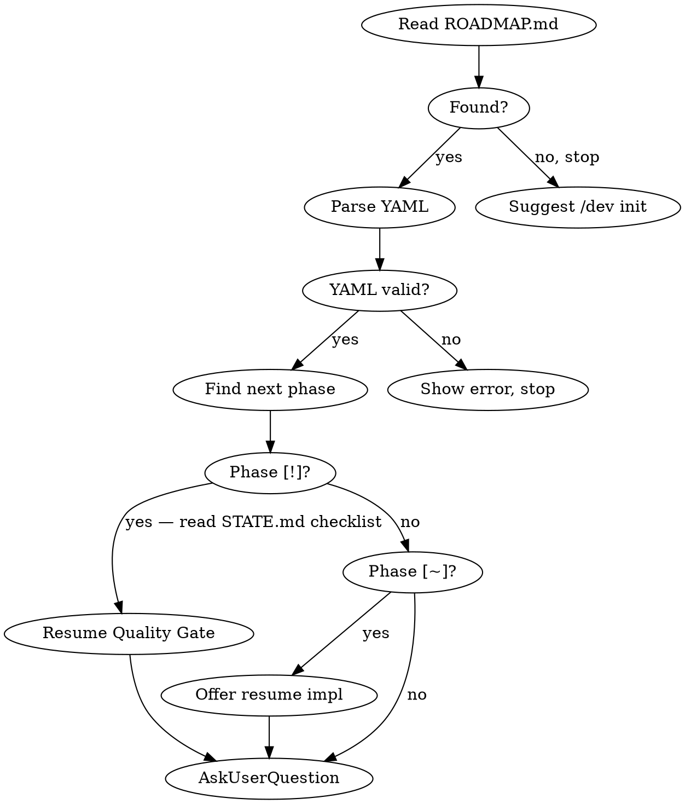
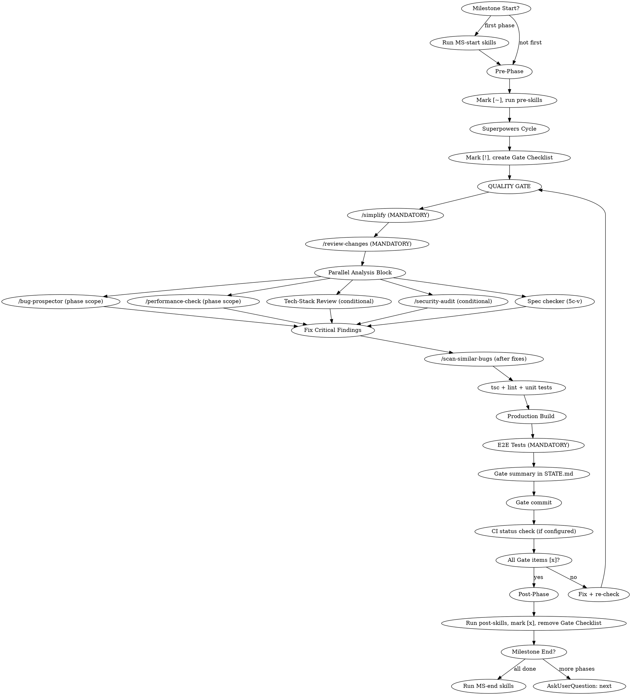
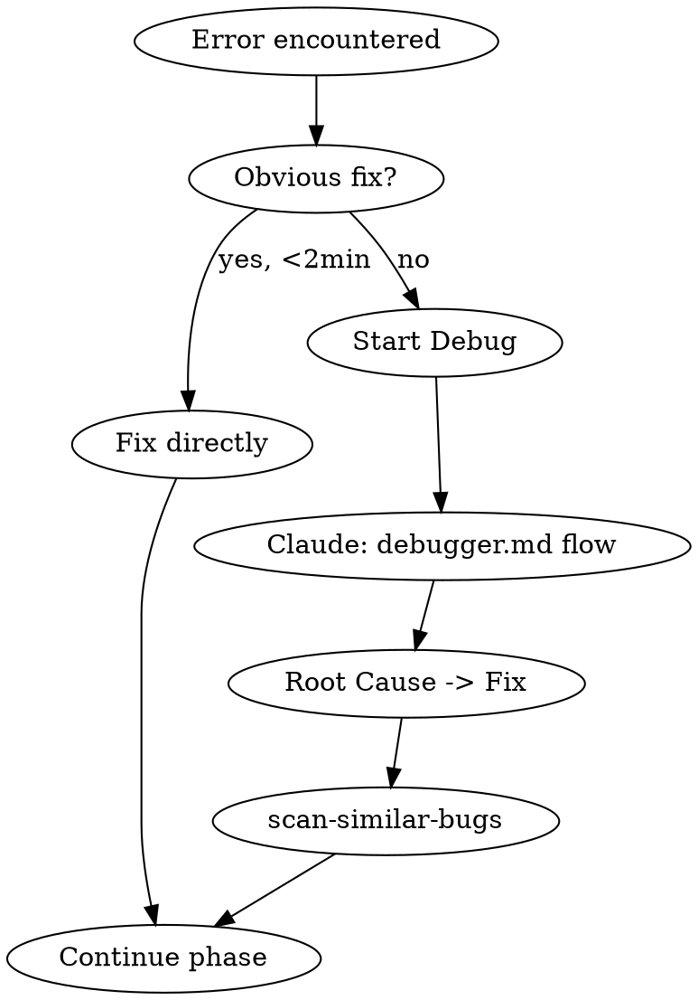

## Language

**IMPORTANT: All user-facing communication MUST be in the user's language** — the language the user writes in, or the language their instructions specify. This includes:
- AskUserQuestion labels, descriptions, and options
- Status summaries and progress reports
- Error messages and warnings
- Commit message bodies (keep conventional commit prefixes in English, e.g. `roadmap:`, `feat:`)
- STATE.md and ROADMAP.md prose sections

Technical terms, skill names, file paths, YAML keys and conventional-commit prefixes stay in English.

---

## Package Manager Detection

Many steps require running project commands (type-check, lint, test). Detect the package manager once per session and reuse:

1. Check for lock files in project root: `pnpm-lock.yaml` → `pnpm`, `bun.lockb` / `bun.lock` → `bun`, `yarn.lock` → `yarn`, `package-lock.json` → `npm`
2. If no lock file: check if `pnpm` / `bun` / `yarn` is available in PATH, fall back to `npm`
3. Store as `$PM` for the session. All commands below use `$PM` as placeholder.

Common commands:
- Type-check: `$PM tsc --noEmit` (or `npx tsc --noEmit` as fallback)
- Lint: `$PM lint` (or `$PM run lint`)
- Unit tests: `$PM test` (or `$PM run test`)
- E2E tests: `$PM test:e2e` (or `$PM run test:e2e`)

---

## Tech-Stack-Aware Skills

Detect the project's tech stack once per session and auto-invoke matching skills at the right points in the lifecycle. Detection runs during Session Start by checking config files and dependencies.

### Detection

| Indicator | Tech Stack | Skills |
|-----------|-----------|--------|
| `next.config.*` or `"next"` in dependencies | **Next.js** | `next-best-practices` |
| `components.json` (shadcn config) | **shadcn/ui** | `shadcn` |
| PostgreSQL connection (`.env` with `DATABASE_URL`, `pg` in deps, migrations dir) | **PostgreSQL** | `pg:design-postgres-tables` |
| `Podfile` / `.xcodeproj` / `Package.swift` | **iOS/macOS** | `swiftui-pro`, `swift-concurrency-pro`, `swift-testing-pro` |
| `*.csproj` with WinUI/WindowsAppSDK | **WinUI** | `winui-pro` |
| `Cargo.toml` or `src-tauri/` directory | **Rust / Tauri** | `rust-best-practices`, `rust-testing`, `tauri-v2` |
| `svelte.config.*` or `"svelte"` in dependencies | **Svelte** | `svelte:svelte-core-bestpractices`, `svelte:svelte-code-writer` (official, + Svelte MCP) |

Store detected stacks as `$TECH_STACKS` for the session (e.g., `[nextjs, shadcn, postgres]`).

### Where Tech Skills Auto-Trigger

**→ Read `tech-stack-triggers.md` in this skill directory for both trigger matrices.**

Summary: Tech skills kick in at two points — during **brainstorming (4a)**, depending on `@type:` and
`$TECH_STACKS`, and in **gate step 5c** as read-only reviews, triggered by the files the phase
actually changed. Two matrices: *Tech-Stack Review* (nextjs, shadcn, ui-scan,
postgres, swift, winui, rust, tauri, svelte) and *Security Review* (auth/login/session/middleware,
API routes/actions, DB schema, as well as `@type: auth`/`backend`). Critical findings → fix **before 5d**.

## Subagent Model Choice

`/dev` dispatches many parallel Agent subagents. **Always specify a model explicitly when dispatching** — an omitted model inherits the most expensive session model (lesson from superpowers 6.x SDD). Choose the cheapest tier that can handle the task:

| Role | Tier |
|-------|------|
| Read-only analysis in Step 5c: `/bug-prospector` or `bug-prospector-neutral` (tool per stack), `/performance-check`, Tech-Stack Review | **cheap tier** |
| `/security-audit` or `/security-review` (phase or full scope), Spec checker (5c-v) | **standard/capable tier** |
| Milestone-end & pre-release full scans (`/bug-prospector` full, `/performance-check` full, `/security-audit` full, `/dead-code-scanner` full) | **capable tier** |

Only the **dispatch model choice** is affected — which checks run and their triggers remain unchanged.

---

## Visual Companion — Mandatory Rules

The Visual Companion is a browser-based server that renders HTML screens. It is used **without asking and without permission** — it is a fixed part of the workflow, not an optional feature.

### Ground Rule: When Browser, When Terminal?

| Content | Medium |
|--------|--------|
| Roadmap progress, phase overview, milestone summary | **Browser** |
| UI layout options, design decisions, wireframes | **Browser** |
| Architecture diagrams, data flow, component relationships | **Browser** |
| Quality Gate findings dashboard (if ≥ 3 findings) | **Browser** |
| Conceptual yes/no questions ("Resume?", "Continue?") | **Terminal** |
| Technical decisions without a visual dimension | **Terminal** |
| Short answers, confirmations, one-line options | **Terminal** |

**Rule of thumb:** If the content consists of more than 3 lines of structured information or has a spatial representation → browser. Exception: questions without a UI/UX side (data model, library choice, naming) stay in the terminal, even if they are longer.

### Mandatory Triggers in `/dev` — always, automatically

| Step | What is shown | Format |
|---------|-----------------|--------|
| **Session Start** (if ≥ 2 phases or milestone change) | Roadmap progress: milestones as progress bars, current phase highlighted, blockers | Building block "Roadmap" |
| **`/dev status`** | Complete roadmap overview with all milestones, phases, status icons | Building block "Roadmap" (all milestones) |
| **Milestone End Summary** | What was built: phase list with Gate summary highlights, next steps | Building blocks "Roadmap" + "Gate dashboard" |
| **Quality Gate Summary** (if ≥ 3 findings across all checks) | Findings by category: critical/note, what was fixed | Building block "Gate dashboard" |
| **`/dev review` Pre-Release** | Quality overview across all Gate summaries: findings trend, open blockers | Building block "Gate dashboard" (across all phases) |
| **Interview / brainstorming — question with a UI/UX side** (any phase size) | The options as mockups side by side, with the states of each option; desktop/mobile and light/dark where the project has both. Answer via `AskUserQuestion`, with the options named identically there | Building blocks "UI decision", "State grid", "Responsive/Dark" |
| **Brainstorming — solution approaches, architecture phase** | One Mermaid diagram per approach (components/data flow) with pros and cons | Building block "Architecture comparison" |
| **Brainstorming — design, architecture phase** | Before/after as two diagrams side by side | Building block "Before/After" |

**When a question has a UI/UX side:** when the answer becomes visible — layout, navigation, a user's flow through views, forms, feedback (error, loading, empty), rendering across sizes and themes. Not: data model, library choice, naming — then no screen, question in the terminal only.

**Look of the screens:** Style rules and ready-made building blocks are in `companion-screens.md` (in this skill directory).

### How the Server Is Started

```bash
# Start server (automatically, without asking) — via the /dev wrapper.
# The wrapper resolves the newest installed superpowers companion and sets
# the display host itself: if DEV_COMPANION_URL_HOST is set (e.g. a Tailscale name),
# the server listens on all interfaces and reports that host, otherwise localhost.
~/.claude/skills/dev/scripts/companion.sh --project-dir <project-root>
# Returns JSON, including:
#   "url":        http://<host>:PORT/?key=<TOKEN>  ← MUST be used verbatim
#   "screen_dir": <session>/content  ← write HTML screens here
#   "state_dir":  <session>/state    ← alive check (server-info / server-stopped)
```

- Store the returned `url` **verbatim** (incl. `?key=<TOKEN>`), as well as `screen_dir` (content dir for HTML screens) and `state_dir` (for the alive check) for the session. `session_dir` = parent directory of `state_dir`/`screen_dir` (for stopping)
- Give the user the `url` **exactly** as it was returned — never reconstruct it, never drop the token, never substitute a different host
- The server stays active for the entire `/dev` session — do not restart it at every step (auto-exit only after 4 h idle, `idle_timeout_ms` in the return value)
- **Alive check** before every HTML write: `<state_dir>/server-info` exists **and** `<state_dir>/server-stopped` is absent; otherwise restart with the **same** `--project-dir` (same port — the open browser tab reconnects by itself, no new URL needed)
- **Protocol details** (how a screen is written/updated) see superpowers `brainstorming/visual-companion.md` — that guide, versioned with superpowers, is authoritative; `/dev` only keeps its trigger table; look and building blocks are in `companion-screens.md`

### Show screen — the Procedure

All mandatory triggers above use the same sequence. Wherever **"Show screen"** appears further below, this is
exactly what is meant — automatically, without asking:

1. **Ensure the server** — alive check; if not active, start `companion.sh --project-dir <project-root>`
   (same `--project-dir` → same port, an open tab reconnects by itself).
2. **Write the HTML screen** — content fragment with the `Write` tool into `screen_dir`.
3. **Share the `url` verbatim** — exactly as returned, including `?key=<TOKEN>`.
   **Never reconstruct it, never substitute a different host.**

The screen is the confirmation surface: from it the user immediately sees whether the state is right.
That is why it always shows the state **after** the change, never the one before.

What a screen looks like — content fragments, style rules, building blocks (Roadmap, Gate dashboard, Waiting, etc.) — is described in `companion-screens.md`.

---

# /dev — Milestone Orchestrator

Manages a project's ROADMAP.md and sequences superpowers cycles for each phase. Delegates all implementation work to existing skills.

## Command Router

| Input | Section |
|-------|---------|
| `/dev` or `/dev next` | Session Start |
| `/dev init` | Roadmap Creation |
| `/dev status` | Status Display |
| `/dev skip` | Skip Phase |
| `/dev add` | Add Phase/Milestone |
| `/dev reorder` | Reorder Phases |
| `/dev review` | Pre-Release Review |
| `/dev debug` | Debug Flow |
| `/dev pause` | Pause Session |
| `/dev check` | Standalone Quality Gate |

## When NOT to Use

- Single-task requests ("fix this bug", "add a button") — use superpowers directly
- Projects without milestones — overkill for small fixes
- When user explicitly asks to skip the orchestrator

---

## Session Start

**Triggered by:** `/dev`, `/dev next`, or automatically when a new session starts and ROADMAP.md exists.



1. **Read ROADMAP.md** from project root. If missing: "No ROADMAP.md found. Run `/dev init` to create one." Stop.
2. **Read STATE.md** from project root. If missing: create it from ROADMAP.md (derive progress, position, session info). If present: use Session Continuity for resume context.
3. **Detect tech stack** — check project root for stack indicators (see Tech-Stack-Aware Skills section). Store as `$TECH_STACKS`. This detection happens ONCE per session and is reused in all subsequent gates.
4. **Parse YAML frontmatter.** If malformed: show error, ask user to fix manually, stop.
5. **Parse phases:** Extract milestones (`##`), goals (`Goal:`), phases (checkbox items), annotations (`@type:`, `@skills:`, `@spec:`, `@plan:`, `@gate:`).
   - States: `[ ]` not started, `[~]` in progress, `[!]` gate pending (implementation done, quality gate outstanding), `[x]` done, `[—]` skipped
6. **Find current position:** First milestone with incomplete phase. If all done: "Roadmap complete!" Offer `/dev add` or `/dev review`.
7. **Show summary** — if ≥ 2 phases remain or a milestone change occurred: **Show screen** (procedure see "Visual Companion"). Content: building block "Roadmap" (`companion-screens.md`) — milestone blocks, progress bars, phase status icons, blockers in red. Additionally a terminal summary:
   ```
   Milestone 2: UI Shell (3/5 phases done)
   Next: Phase 4 — Connections View (@type:ui @gate:fast)
   Tech Stack: [nextjs, shadcn, postgres]
   Pre-skills: [workflow-audit]  Post-skills: [requesting-code-review]
   Blockers: <from STATE.md, if any>
   ```
   Show `@gate:` only if not `full`. Show `$TECH_STACKS` only on first session start or if changed.
   With 1 remaining phase or a plain entry without milestone context: terminal only.
8. **AskUserQuestion** (single-select):
   - **Start next phase (Recommended)** — "Begin Phase N: <name>" (or "Resume Implementation" if `[~]`, or "Resume Quality Gate: next step — `[ ] /simplify`" if `[!]` — show the first open `[ ]` entry from the STATE.md Gate Checklist directly in the label)
   - **Show full status** — complete roadmap table
   - **Add milestone/phase** — extend roadmap
   - **Skip this phase** — skip with reason
   - **Start Pre-Release Review** — only show if all phases of all milestones are `[x]` or `[—]`

---

## Status Display

**Triggered by:** `/dev status` or "Show full status"

1. **Read STATE.md** — show Blockers & Risks (if any) and Session Continuity at the top.
2. **Show full roadmap — Show screen** (procedure see "Visual Companion"). Content: building block "Roadmap" (`companion-screens.md`) — all milestones, all phases with status icons, spec/plan links, blockers in red at the top. Additionally a short terminal form:
   ```
   ### Blockers
   - Windows Dashboard: placeholder only

   ### Milestone 1: Foundation (3/3) — Complete
   | # | Phase | Type | Status | Spec | Plan |
   |---|-------|------|--------|------|------|
   | 1 | Database Layer | backend | done | [spec] | [plan] |

   ### Milestone 2: UI Shell (1/3)
   | 1 | Navigation | ui | done | [spec] | [plan] |
   | 2 | Connections View | ui | next | — | — |
   | 3 | Dashboard | ui | pending | — | — |

   ### Requirements: 26/30 complete
   ### Last session: 2026-03-20 — Stopped at: ROADMAP consolidated
   ```
3. **Update STATE.md** Session Continuity with current timestamp.

After display: AskUserQuestion with Start/Add/Skip/Done options.

---

## Roadmap Creation

**Triggered by:** `/dev init`

**→ Read `roadmap-creation.md` in this skill directory for the full interactive flow.**

Summary: Interactive AskUserQuestion flow for project goal, phase types, milestone count, skill discovery + security review, trigger configuration, preview + confirm. Creates ROADMAP.md + STATE.md and commits both.

---

## State Tracking (STATE.md)

STATE.md is the project's persistent state file. It tracks progress, requirements, constraints, risks, and session continuity across conversations.

### When to Read STATE.md

- **Every `/dev` and `/dev next` invocation** — read before showing summary
- **`/dev status`** — use STATE.md data for the status display
- **Session start** (when ROADMAP.md exists) — read STATE.md for context

### When to Update STATE.md

| Event | What to Update |
|-------|---------------|
| Phase starts (`[ ]` → `[~]`) | Current Position, Last activity |
| Phase enters gate (`[~]` → `[!]`) | Current Position, Last activity, **create Quality Gate Checklist section** |
| Gate step completes | Check off item in Gate Checklist |
| Gate summary written (5i) | **Append Gate summary** under `### Gate summary — Phase N` in STATE.md (permanent — never removed) |
| `/dev check` completed (5i) | **Append Check summary** under `## Context` in STATE.md (permanent — never removed) |
| Phase completes (`[!]` → `[x]`) | Current Position, Progress table, Last activity, **remove Quality Gate Checklist section** |
| Phase skipped (`[ ]` → `[—]`) | Current Position, Progress table, Last activity |
| Milestone completes | Progress table, Next milestone in Current Position |
| Key decision made | Add to Constraints or a Decisions section |
| Blocker discovered | Add to Blockers & Risks |
| Blocker resolved | Remove from Blockers & Risks |
| Session ends (user pauses) | Session Continuity: Last session, Stopped at, Resume hint |
| `/dev init` | Create fresh STATE.md |

### Update Rules

- **Current Position**: OVERWRITE on every phase transition
- **Progress table**: OVERWRITE milestone row when phase count changes
- **Blockers & Risks**: APPEND new, REMOVE resolved
- **Session Continuity**: OVERWRITE on every session pause/end
- **Constraints / Core Value**: IMMUTABLE after init (unless user explicitly changes)

### STATE.md is NOT for

- Detailed plan contents (those go in spec/plan files)
- Code-level decisions (those belong in CLAUDE.md or code comments)
- Debug state (that goes in `.debug/` files)
- Performance metrics or velocity tracking (unnecessary overhead)

**Exception: Gate summaries** — these stay in STATE.md permanently. They are not temporary state but a quality knowledge log. Each Gate summary under `### Gate summary — Phase N` is NOT removed on phase completion. Only the `## Quality Gate — Phase N` checklist section is removed. The same applies to **Check summaries** (created by `/dev check`) — these too are kept permanently under `## Context` and are never removed.

---

## Skill Trigger Resolution

1. Read `@type:` from phase (e.g., `ui`)
2. Look up `defaults.phase-types.<type>.pre` and `.post` from frontmatter
3. Apply phase overrides:
   - `@skills:+pre[a]` → append to pre defaults
   - `@skills:+post[a]` → append to post defaults
   - `@skills:pre[a]` (no `+`) → replace pre defaults
   - `@skills:post[a]` (no `+`) → replace post defaults
4. Multiple combine: `@skills:+pre[a] @skills:+post[b]`
5. Unknown type → warn, continue with empty lists

### Built-in Phase Types

| `@type:` | Special behavior in the Quality Gate |
|----------|------------------------------|
| `ui` | Tech-Stack Review shadcn/next-best-practices conditionally active |
| `backend` | Security Audit always active (even without auth files); pg:design-postgres-tables conditionally active |
| `auth` | Security Audit always active (full scope, not phase scope) |
| `security` | Security Audit always active (full scope); Spec checker: acceptance criteria without a test are always critical |
| `refactor` | `/scan-similar-bugs` in full-codebase mode instead of phase scope |
| `data` | pg:design-postgres-tables always active; Security Audit active |
| `migration` | Specific risks: irreversibility, data loss. In addition to the `data` checks: (1) Security Audit always active, (2) `/bug-prospector` explicitly checks for a missing DOWN migration / rollback path, (3) the E2E test must include a migration smoke test (migrate up + verify data + migrate down if possible). `@gate: fast` is FORBIDDEN for migration phases. |
| `docs` | Purely documentation phases (README, API docs, changelog, CLAUDE.md). Minimal gate: `/simplify`, `/review-changes`, tsc + lint run normally. **Dropped automatically:** Security Audit, E2E Tests, Production Build, Spec checker (5c-v), `/scan-similar-bugs`, `/performance-check`, Tech-Stack Review. `@gate: fast` is semantically wrong here — use `@type: docs` instead. |

### `@gate:` Annotation — Controlling the Gate Mode

Phases can control the gate mode via a `@gate:` annotation:

| Annotation | Effect |
|------------|--------|
| `@gate: full` | Standard — all steps run (default, does not need to be specified) |
| `@gate: fast` | Skips conditional parallel checks (Tech-Stack Review, Security Audit, scan-similar-bugs). Mandatory steps (simplify, review-changes, bug-prospector, performance-check, tsc, build, E2E) always run. For fast iteration phases. |
| `@gate: ci-wait` | Adds an explicit CI status wait before `[x]`, even if CI is otherwise not configured. |

**When to use `@gate: fast`:** Only for purely documentation phases, config-only changes, or when you deliberately want to iterate fast. Never for phases with auth, API, or DB changes.

**Conflict rule — `@gate: fast` is automatically ignored for:**
- `@type: security`, `@type: auth` — security checks are always mandatory for these types
- `@type: backend` with DB migrations — Security Audit stays active
- `@type: refactor` — `/scan-similar-bugs` stays active in full-codebase mode, even with `@gate: fast`. Refactoring moves code — that is exactly the case where similar bug patterns can show up elsewhere. `scan-similar-bugs` is the only CONDITIONAL check that runs for refactor phases despite `@gate: fast`.
- If changed files match auth/API/migration patterns — Security Audit stays active regardless of `@gate:`

On conflict: warn (`"@gate: fast ignored — @type:auth requires full gate"` / `"@gate: fast: /scan-similar-bugs stays active — @type:refactor"`), then continue with the override.

---

## Halt on Irreversible Actions

Across all phase steps: **for anything that `git revert` cannot undo, stop and
ask** — even in the middle of an autonomous run, even if the plan includes the step.

The criterion is not "feels risky", but: *if this was wrong, does a
commit revert restore the state?* If the answer is no, the decision belongs to the user:

- Schema and data migrations, especially destructive ones (`DROP`, `DELETE`, `TRUNCATE`, type changes)
- any change to a **shared** development or staging database — it takes effect immediately
  for all parallel sessions, not only on merge
- Deploys, releases, tags, force-pushes, deleting branches
- outgoing messages to real recipients (mail, push, webhooks) and payment transactions
- Writing to external storage, registries or object storage
- anything that touches secrets, keys or credentials

Procedure: stop, say in one sentence what would happen and what about it cannot be undone,
state the proposal, get approval. For `@type: migration` this halt is mandatory and cannot
be replaced by a line in the plan — a plan that describes the migration is not approval
to run it.

---

## Phase Execution



### 1. Milestone Start Check

First phase of new milestone → run `defaults.skills.milestone-start` as parallel Agent subagents. Missing skills → warn and skip.

### 2. Pre-Phase

1. Mark phase `[~]` in ROADMAP.md (Edit tool)
2. Resolve pre-skills (see Skill Trigger Resolution)
3. Dispatch pre-skills as parallel Agent subagents

### 3. Pre-Skill → Brainstorming Handoff

If pre-skills produced output files (e.g., `workflow-audit` generates `.workflow-audit/handoff.yaml`), check for these files and pass them as context to brainstorming:
- "The following pre-skill output is available as context: [file path]"
- Read the file and include relevant findings in the brainstorming context

### 4. Superpowers Cycle

**Resume logic:**
- Phase is `[!]` → skip directly to Quality Gate (step 5), read Gate Checklist from STATE.md to find remaining steps
- Phase is `[~]` with `@plan:` path on disk → skip to execution (4c)
- Phase is `[~]` with `@spec:` path on disk → skip to planning (4b)
- Phase is `[~]` with neither → start from brainstorming (4a); if an approved chat draft exists in STATE.md (small phase), continue from there instead of clarifying again

**4a. Clarification and brainstorming:**
1. **Classify:** architectural if the phase creates a new project or subsystem, changes how components interact, or changes interfaces that others build on; `@type: migration` always. When in doubt, architectural. For `@type: docs`, no interview.
2. **Architectural → interview in rounds per `befragung.md` (interview rounds)** (in this skill directory, incl. ADRs), then `superpowers:brainstorming` with the handoff note from `befragung.md`.
3. **Small → `superpowers:brainstorming`** with the instruction: every question via `AskUserQuestion`, recommendation first with "(Recommended)"; look up facts yourself instead of asking. Record the approved chat draft with acceptance criteria in STATE.md under the phase — the basis for the Spec checker (5c-v) and for resuming.

In both cases: State context: phase name, type, milestone goal, any pre-skill output. And the companion instruction: "The Visual Companion is already running (URL below). Do not offer it, use it directly for every question with a UI/UX side and for architecture diagrams; building blocks in `companion-screens.md` of the `/dev` skill." Before that, ensure the companion via the "Show screen" procedure and pass along the URL. Include matching tech skills beforehand — see `tech-stack-triggers.md`, section "During Brainstorming". Brainstorming chains to `superpowers:writing-plans` → `superpowers:subagent-driven-development` internally. After spec produced: add `@spec:` to ROADMAP.md.

**4b. Planning (resume):** Invoke `superpowers:writing-plans`. After plan produced: add `@plan:` to ROADMAP.md.

**4c. Execution (resume):** Invoke `superpowers:subagent-driven-development` with plan path. **Scope boundary (important):** SDD only performs **implementing tasks + per-task reviews**, then **STOP** — it must
- **not** run `finishing-a-development-branch` (no merge/PR): `/dev` owns completion via its Quality Gate (Step 5) → Gate commit → any later sync/merge step;
- **not** create a new/nested worktree — work in the **current** branch/worktree (sessions that already run in their own worktree would otherwise get project-local `.worktrees/` created by 6.x);
- **not** run a final whole-branch review — `/dev`'s gate (`/review-changes`, `/bug-prospector`, `/security-audit`) covers that.
Pass this boundary explicitly when invoking SDD.

**4d. Verification:** Invoke `verification-before-completion`.

**4e. Gate Transition (`[~]` → `[!]`):**
1. Mark phase `[!]` in ROADMAP.md (Edit tool)
2. Create Quality Gate Checklist in STATE.md (see below)
3. Update STATE.md Last activity: "Implementation complete, Quality Gate starting"

The `[!]` status means: implementation is done, but the mandatory Quality Gate has not yet passed. This is the **only** path to `[x]` — a phase MUST go through `[!]` first. Direct `[~]` → `[x]` transitions are **forbidden**.

**Gate Checklist format** (append to STATE.md):

The checklist is **dynamically generated** at gate entry based on `$TECH_STACKS` and which files were changed. Only include items that will actually run.

```markdown
## Quality Gate — Phase N: <Name>
<!-- @gate: full | fast (default: full) -->

<!-- MANDATORY — always, even with @gate: fast -->
- [ ] /simplify
- [ ] /review-changes
- [ ] /bug-prospector (phase scope)
- [ ] /performance-check (phase scope)
- [ ] Spec checker (5c-v)                      <!-- against @spec:, otherwise chat draft from STATE.md -->
<!-- CONDITIONAL — dropped with @gate: fast; omit if condition not met -->
- [ ] Tech-Stack Review: next-best-practices   <!-- next.config.* changed -->
- [ ] Tech-Stack Review: shadcn                <!-- components/** with shadcn imports -->
- [ ] Tech-Stack Review: pg:design-postgres-tables  <!-- migrations/SQL changed -->
- [ ] Security Audit                           <!-- auth/api/migration changed OR @type: backend/auth/security/data -->
- [ ] /scan-similar-bugs                       <!-- dropped with @gate: fast -->

<!-- MANDATORY — always, even with @gate: fast -->
- [ ] tsc + lint + tests
- [ ] Production Build
- [ ] E2E Tests

<!-- MANDATORY — always -->
- [ ] Gate summary (STATE.md)
- [ ] Gate commit
- [ ] CI status check                          <!-- only if CI configured OR @gate: ci-wait -->
```

**Rules for creating the checklist:**
- Create the checklist immediately on the `[~]` → `[!]` transition
- Read the phase's `@gate:` annotation — with `fast`: omit all CONDITIONAL entries
- **`@type: docs`**: omit all CONDITIONAL entries + additionally omit `Production Build`, `E2E Tests` and `Spec checker (5c-v)`. Only `/simplify`, `/review-changes`, `tsc + lint + tests`, `Gate summary`, `Gate commit` remain.
- Omit conditional entries if the condition is not met — do not mark them `[—]`, just omit them
- Each step checks off its entry after completion
- **Every checkmark needs evidence.** An `[x]` is only set if the step has run
  AND the decisive output line follows it: `- [x] tsc + lint + tests — 0 errors, 412 passed`.
  No evidence → the checkmark stays open. "Looks right", "should pass" and "I already checked
  that earlier" are not evidence.
- **A command whose output was not read has not run.** Exit code 0 is not enough if the
  output went through a pipe (`| tail`, `| head`, `2>/dev/null`) — a pipe can swallow the
  status of the left-hand side. When in doubt, repeat the command without the pipe.
- **"Success" at the overall level does not prove the sub-steps.** A green CI run, a green
  deploy or a tool that reports success may have skipped or silently
  omitted sub-steps. What is proven is the step that was checked — not the frame it ran in.
- If the session ends mid-gate: the next session reads STATE.md and resumes at the first open `[ ]`
- CI status check: only include if `.github/workflows/` exists or `@gate: ci-wait` is set

### 5. Mandatory Quality Gate

**MANDATORY — cannot be skipped, not optional. All steps run after every phase.**

These steps run regardless of `@skills:` configuration — they are hardcoded into the phase lifecycle and cannot be overridden or removed via ROADMAP.md annotations. The phase stays `[!]` until every checklist item is `[x]`.

**5a. /simplify** — modifies code: reviews all changed code for reuse, quality, and efficiency; fixes issues automatically. Must run first so that `/review-changes` sees the cleaned-up code.
- After completion: check off `[ ] /simplify` in STATE.md Gate Checklist.

**5b. /review-changes** — pre-commit review of all changes (after simplify) for bugs, security vulnerabilities, performance issues, and missing tests. Read-only — flags issues, does not auto-fix.
- **Critical issues** (security vulnerabilities, data loss risks, logic errors): fix them before proceeding to 5c.
- **Warnings** (style, minor improvements): note them but proceed — `/simplify` already handled code quality.
- After completion: check off `[ ] /review-changes` in STATE.md Gate Checklist.

**5c. Parallel Analysis Block** — dispatch the following as **parallel Agent subagents** (all read-only). **Set the model explicitly** (see "Subagent Model Choice": bug-prospector/performance-check/Tech-Stack → cheap tier, security-audit → standard/capable). Wait for all, at most **15 minutes**. If a subagent is still running after 15 minutes: cancel it, mark its findings as "timeout — skipped", note it in STATE.md, continue with 5d. A hanging analyzer does not block the entire gate.

**Dispatch prompt for the analyzers — two rules that determine the hit rate:**
- **Prompt for refutation, not for checking.** "Find what is wrong with this change"
  yields different results than "check this change". Whoever asks for confirmation gets it.
- **Hand over the artifact without your own reasoning.** Diff plus the requirement it is
  supposed to meet — not the reasoning for why the solution is correct. If you pass along your
  conclusions, you get their confirmation back instead of a review.

**Scope and tool:** The phase's changed files also include new, untracked files (`git ls-files --others --exclude-standard`). Wherever `/bug-prospector` or `/security-audit` appears below, the mapping **analysis tool per stack** in `tech-stack-triggers.md` applies: in web, Rust and mixed projects, a stack-neutral bug hunter and `/security-review` run.

  **5c-i. /bug-prospector (phase scope)** — analyzes the files changed in this phase through 7 lenses (assumptions, state machines, boundary conditions, data lifecycle, error paths, time-dependent behavior, platform divergence). **Scope:** Only the changed files and their immediate callers/dependencies — NOT the entire codebase.

  **5c-ii. /performance-check (phase scope)** — scans changed files for performance anti-patterns (memory leaks, unnecessary re-renders, N+1 queries, hot-path bloat, missing indexes on new queries, unoptimized data fetching). **Scope:** Only changed files and immediate context.

  **5c-iii. Tech-Stack Review (conditional)** — triggered based on `$TECH_STACKS` and changed files. Trigger matrix: `tech-stack-triggers.md`. Skip silently if no relevant files were changed.

  **5c-iv. /security-audit (conditional)** — triggered when changed files touch security-sensitive areas. Trigger matrix: `tech-stack-triggers.md`. Skip if no security-sensitive files were changed.

  **5c-v. Spec checker** — read-only, prompted for refutation; receives the diff (incl. untracked files) and the spec from `@spec:`, **without** the reasoning behind the implementation. Reports, each with a quote of the spec line: (a) required, but missing or only partially implemented; (b) implemented, but not required; (c) implemented, but probably wrong; (d) acceptance criterion without a test. (a), (c) and (d) are critical, (b) is a note; with `@type: security`, (d) is always critical. For (d): write the test and **see it red once** — briefly break the checked code, test red, restore the code, test green; record the invocation and result as evidence in the checklist. Without `@spec:` (small phase, draft only in chat) it checks against the approved chat draft with acceptance criteria from STATE.md, failing that against the phase description in the ROADMAP; if neither exists, it is dropped with the note "no spec".

**After all parallel agents complete:**
- Collect all findings. Separate critical from non-critical.
- **Critical findings** (logic errors, data corruption, race conditions, memory leaks, N+1 in loops, missing DB indexes, security vulnerabilities, auth bypasses): fix ALL before proceeding to 5d.
- **Non-critical findings** (edge cases, optimization suggestions, style hints): note in STATE.md Blockers & Risks, proceed.
- After completion: check off all applicable `[ ]` items in STATE.md Gate Checklist.

**5d. /scan-similar-bugs** — after any fixes from the parallel block: scan the broader codebase for the same patterns that were just fixed. Prevents regression of the same class of bug elsewhere. Scope: full codebase, but focused on patterns found in 5c.
- Findings: fix automatically where straightforward, note complex ones in STATE.md.
- After completion: check off `[ ] /scan-similar-bugs` in STATE.md Gate Checklist.

**5e. Verification + Unit Tests** — after all fixes from 5a–5d:
1. Re-run `$PM tsc --noEmit` and `$PM lint` to confirm no regressions.
2. Run unit/integration tests: `$PM test` (or equivalent). If the project has a `test` script in `package.json`, `Makefile`, or similar — run it. For native projects: use `/run-tests`.
3. All three must be green before proceeding. Fix failures before moving on.
- After completion: check off `[ ] tsc + lint + tests` in STATE.md Gate Checklist.

**5f. Production Build** — verify the project builds successfully. `tsc --noEmit` checks types but misses build-time errors (Server/Client boundaries, dynamic imports, bundler issues, asset resolution, etc.).

Detect build command by technology:

| Technology | Build command |
|-------------|-------------|
| Next.js | `$PM next build` (or `$PM build` if mapped in package.json) |
| Vite / React / Vue | `$PM build` |
| .NET / WinUI | `dotnet build` |
| Swift / iOS / macOS | `xcodebuild build` (via `/using-xcode-cli`) |
| Go | `go build ./...` |
| Rust | `cargo build` |
| Library (npm) | `$PM build` if build script exists |

Detection: Check `package.json` `scripts.build`, `Makefile`, `.csproj`, `Package.swift`, `Cargo.toml`, `go.mod` — use the first match.

If no build command exists (e.g., pure script project): skip, no warning needed.

Build must succeed before E2E tests. Fix build errors before proceeding.
- After completion: check off `[ ] Production Build` in STATE.md Gate Checklist.

**5g. E2E / Integration Tests** — run automated end-to-end tests against the changed areas.

**→ Read `e2e-testing.md` in this skill directory for the full decision matrix and execution steps.**

Summary: Determine testability by tech stack, detect existing infrastructure (Playwright/Cypress/Vitest/XCTest/xUnit), run matching specs, generate smoke tests for new features without specs. Test fails from phase changes must be fixed; pre-existing/flaky failures are documented in STATE.md.
- After completion: check off `[ ] E2E Tests` in STATE.md Gate Checklist.

**5h. removed** (since 2026-09-25) — test gaps are reported by the Spec checker (5c-v, item d); tests generated after the fact merely read off the code and are green from the first run.

**5i. Gate summary** — write a compact 3-line summary of the gate into STATE.md as its own section **below** the phase completion info. Format:

```markdown
### Gate summary — Phase N: <Name>
- Found: <N critical + M notes> (simplify: X fixes, bug-prospector: Y findings, security: W findings)
- Fixed: <what was fixed, in one sentence>
- Tests: <Spec checker N gaps, tests red→green proven | no gaps>
```

This builds up a quality knowledge log across phases and makes cross-phase patterns visible. The summary stays in STATE.md permanently (it is not removed on phase completion like the checklist).
- After completion: check off `[ ] Gate summary (STATE.md)` in STATE.md Gate Checklist.

**5j. Gate commit** — once ALL checklist items are `[x]`: create an atomic commit that captures the gate-verified state. This commit is the canonical "this phase passed QA" snapshot.
- Commit message: `chore: quality gate — Phase N <name> [gate-pass]`
- **Before committing: check the baseline.** Read `git branch --show-current` and `git status --porcelain`.
  The commit includes exclusively the files of this phase.
  - Wrong branch → STOP, do not commit, ask the user.
  - Changes to files this phase did not touch (parallel session in a shared
    working tree, tools that rewrite files on startup) → do **not** stage these files.
    Never `git add -A` or `git add .`; stage the phase's paths explicitly.
  - If it remains unclear whether a change belongs to the phase → ask, do not sort it in. A
    Gate commit that sweeps up someone else's work is worthless as a rollback point and pulls an
    uninvolved session into the phase.
- This commit happens **before** post-phase skills run, so the clean state is preserved regardless of what post-skills produce.
- After commit: check off `[ ] Gate commit` in STATE.md Gate Checklist.

**5k. CI status check (conditional)** — checks the CI status of the Gate commit. Triggers if:
- `.github/workflows/` exists in the project, OR
- `@gate: ci-wait` is set

If CI is configured: wait for CI completion via `gh run watch` or `gh run list --branch <branch>`. Timeout: 10 minutes. On CI failure: show logs, repair, create a new Gate commit. `[x]` may only be set after CI is green.

If no CI: skip, omit the checklist entry.
- After completion: check off `[ ] CI status check` in STATE.md Gate Checklist.

### 6. Post-Phase

**Pre-condition:** All items in the STATE.md Gate Checklist must be `[x]`. If any are unchecked, return to the first unchecked step and complete it. Do NOT proceed to Post-Phase with an incomplete checklist.

Dispatch post-skills as Agent subagents. **Parallelization:** Read-only analysis skills run in parallel. Skills needing final code state run after analysis completes.

**Note:** `/simplify`, `/review-changes`, `/bug-prospector`, `/performance-check`, `/security-audit`, `/scan-similar-bugs`, Spec checker, `/ui-scan`, build verification, unit tests, and E2E tests have already run in step 5. Do not run them again as post-skills even if listed in `@skills:post[]`.

**The Gate commit has already happened** — post-skills run on the gate-verified code state.

### 7. Phase Completion (`[!]` → `[x]`)

1. **Verify Gate Checklist:** Read STATE.md, confirm ALL Quality Gate items are `[x]`. If any unchecked → STOP, return to first unchecked step 5.
2. **Verify CI (if applicable):** If CI status check in checklist — confirm it is `[x]` (green). If not → wait or fix CI first.
3. Mark `[x]` in ROADMAP.md (replacing `[!]`), ensure `@spec:` and `@plan:` present
4. **Remove Gate Checklist** from STATE.md (the `## Quality Gate — Phase N` section). **The Gate summary is kept.**
5. **Update STATE.md**: Current Position, Progress table, Last activity
6. Commit: `roadmap: complete Phase N — <name>`
7. All phases done in milestone? → Milestone End

### 8. Next Action

AskUserQuestion: Start next phase (Recommended), Pause, Review milestone.

---

## Milestone End

All phases `[x]` or `[—]`:

1. **Run `defaults.skills.milestone-end`** as parallel agents (if configured).
2. **Mandatory Parallel Block** — dispatch as parallel Agent subagents (**model explicit: capable tier for full scans**, see "Subagent Model Choice"), wait for all to complete:
   - **`/bug-prospector`** (full mode, tool per stack) — deep analysis of the entire milestone scope through all 7 lenses.
   - **`/performance-check`** (full mode) — comprehensive performance anti-pattern scan across the milestone's changes.
   - **`/security-audit`** (full mode, tool per stack) — complete security scan of the entire milestone scope. Even if every phase already had conditional security audits, full mode uncovers cross-cutting attack surfaces (interplay of several components, cumulative risks).
   - Critical findings from all three: fix before proceeding.
   - Non-critical findings: note in STATE.md under Blockers & Risks.
3. **Mandatory: `/dead-code-scanner`** (quick mode) — scans for unused code accumulated across the milestone's phases. Hardcoded, runs regardless of configuration.
   - If dead code is found: show findings, fix automatically where safe (unused imports, unreferenced functions), ask for confirmation on larger removals.
4. Re-run `$PM tsc --noEmit` and `$PM lint` after any fixes from steps 2–3.
5. **Update STATE.md** (Progress table, Current Position to next milestone).
6. **Show summary — Show screen** (procedure see "Visual Companion"). Content: building blocks "Roadmap" + "Gate dashboard" (`companion-screens.md`) — completed phases with Gate summary highlights (critical findings/fixes), next steps, milestone name + goal prominently at the top.
7. AskUserQuestion: Next milestone (Recommended), Pre-release review (if configured), Pause.

---

## Phase Interruption

**Triggered by:** User says "drop it", "do something else", "stop", "cancel" or similar during an active `[~]` or `[!]` phase.

**Behavior:**
1. **Stop current work immediately.** Do not continue the current skill invocation.
2. **AskUserQuestion** (single-select):
   - **Pause phase** (Recommended) — save progress in STATE.md, keep phase `[~]`/`[!]`, resume later with `/dev next`
   - **Skip phase** — mark `[—]` with reason, move to next phase
   - **Do something else** — pause via STATE.md, then handle the user's new request outside `/dev`
3. For "Pause phase" and "Do something else": update STATE.md Session Continuity with what was in progress (e.g., "Phase 3 — interrupted after brainstorming, plan still pending").
4. For "Do something else": do NOT automatically resume the phase after the side task — the user must explicitly say `/dev` or `/dev next` to resume.

**Key rule:** Interruptions preserve state. No work is lost. The `[~]`/`[!]` status and any Gate Checklist items already checked remain intact.

---

## Pause Session

**Triggered by:** `/dev pause`

Explicitly saves session state for clean handoff to next conversation.

1. **Update STATE.md** Session Continuity:
   - `Last session`: today's date
   - `Stopped at`: current phase name + what was in progress (e.g., "Phase 6 Dashboard — brainstorming complete, plan pending")
   - `Resume`: specific next action (e.g., "`/dev next` to continue planning Phase 6")
2. **Clean up the Visual Companion** (if the server is active):
   - Push a waiting screen: `<div style="display:flex;align-items:center;justify-content:center;min-height:60vh"><p class="subtitle">Session paused — continue with /dev</p></div>`
   - Then stop the server: `~/.claude/skills/dev/scripts/companion-stop.sh <session_dir>`
3. Show confirmation: "Session saved. Next time, run `/dev` to resume."

---

## Debug Flow

**Triggered by:**
- `/dev debug` or `/dev debug <description>` — explicit user request
- User says "fix crash", "why is this broken", "not working", "find bug"
- **Automatically during Phase Execution** when:
  - Build fails and the error is not a simple typo or missing import (i.e., requires investigation)
  - Tests fail after implementation and the cause is not immediately obvious
  - App crashes during `build-and-run`
  - A verification step reveals unexpected behavior

**When NOT to use debug flow:**
- Compiler error with obvious fix (missing semicolon, typo, wrong type) → just fix it
- Build failure due to missing dependency → just add it
- Test fails because test expectations need updating → just update
- If the fix is obvious within 2 minutes, skip the debug flow



Read and follow `debugger.md` in this skill directory for the Claude-side flow. It implements scientific debugging with persistent state files in `.debug/`, a knowledge base that learns from past bugs, and session resume capability.

Key integration points:
- Debug files record which `/dev` phase was active (if any)
- After fix: `scan-similar-bugs` runs automatically
- After archive: returns to the `[~]` phase if one was in progress
- Knowledge base (`.debug/knowledge-base.md`) accelerates future debugging

---

## Skip Phase

**Triggered by:** `/dev skip`

1. Show phase to skip. AskUserQuestion: Skip with reason (Other for free text), Cancel.
2. Update ROADMAP.md: `[—]` + `<!-- skipped: <reason> -->`
3. **Update STATE.md**: Current Position, Progress table, Last activity.
4. Commit.
5. **Show screen** — updated roadmap (building block "Roadmap" in `companion-screens.md`), with the skipped phase marked with the `[—]` icon and the reason.
6. Return to Session Start.

---

## Add Phase/Milestone

**Triggered by:** `/dev add`

AskUserQuestion: Add phase (Recommended) or Add milestone.

**Phase:** Which milestone → name → type → position (end or after specific phase) → extra skills → Edit ROADMAP.md → commit.
**Milestone:** Name/goal → phases → append to ROADMAP.md → commit.

After the commit: **Show screen** — updated roadmap (building block "Roadmap" in `companion-screens.md`), with the new phase/milestone highlighted with a "new" badge.

Warn if adding to a completed milestone.

---

## Reorder Phases

**Triggered by:** `/dev reorder`

Only `[ ]` phases can move. `[x]`, `[!]`, `[~]`, `[—]` stay. If <2 movable: "Nothing to reorder." AskUserQuestion: which phase → which position → Edit → commit.

After the commit: **Show screen** — updated roadmap (building block "Roadmap" in `companion-screens.md`), with the moved phase shown in its new position with a "moved" badge.

---

## Pre-Release Review

**Triggered by:** `/dev review`

1. **Mandatory Parallel Block** — dispatch as parallel Agent subagents (**model explicit: capable tier**, see "Subagent Model Choice"):
   - **`/bug-prospector`** (full mode, tool per stack) — entire codebase, 7 lenses.
   - **`/performance-check`** (full mode) — entire codebase.
   - **`/security-audit`** (full mode, tool per stack) — entire codebase. Critical — must be green before release.
   - Critical findings from all three: fix before proceeding. Non-critical: note in STATE.md.
2. **Mandatory: `/dead-code-scanner`** (full mode) — comprehensive scan of the entire codebase. Fix findings, then re-run `$PM tsc --noEmit` + `$PM lint`.
3. **Read Gate summaries** — read all `### Gate summary` entries from STATE.md. If there are none (first release or fresh project): output the note "No gate history available — this is the first release", skip this step. If present: show a consolidated quality picture: which findings were found and fixed across all phases? Are there recurring patterns?
4. Read `defaults.skills.pre-release`. Run each configured skill **sequentially** (each may change code):
   - Dispatch Agent subagent → wait → show summary → AskUserQuestion: Continue (Recommended) or Pause
5. Final summary after all skills.

---

## Standalone Quality Gate

**Triggered by:** `/dev check`

**→ Read `dev-check.md` in this skill directory for the full flow.**

Summary: Precondition is **no active phase** (`[~]`/`[!]` → stop, point to `/dev next`).
Snapshot of the changed files as an immutable `$CHECK_SCOPE`, then the same steps
5a–5k as the phase gate against that scope, Check summary in STATE.md, check commit
`chore: dev check [gate-pass]`.

## Error Handling

| Scenario | Behavior |
|----------|----------|
| ROADMAP.md missing | Suggest `/dev init`. Stop. |
| YAML malformed | Show error. Stop. |
| Unknown `@type:` | Warn, continue with empty skill lists. |
| Skill not installed | Warn, skip, continue. |
| Phase `[!]` found | Resume Quality Gate — read STATE.md checklist, continue from first unchecked item. |
| Phase `[~]` found | Offer resume via spec/plan file detection. |
| Phase `[—]` found | Skip in sequencing, show reason on status. |
| All phases done in MS | Auto-trigger Milestone End. |
| All milestones done | "Roadmap complete!" Offer add/review. |
| `@skills` parse error | Warn, use defaults. |
| `@gate: fast` + `@type: security/auth` | Warn: "`@gate: fast` ignored — @type requires full gate". Continue with `full`. |
| `@gate: fast` + `@type: refactor` | Warn: "`@gate: fast`: `/scan-similar-bugs` stays active — @type:refactor". Only this one check remains, the rest as with `fast`. |
| `@gate: fast` + `@type: migration` | Warn: "`@gate: fast` ignored — @type:migration always requires full gate". Continue with `full`. |
| `@gate: fast` + auth/API files changed | Warn: "Security Audit active despite @gate:fast — security-relevant files changed." |
| `@gate:` unknown value | Warn, fall back to `full`. |
| `/dev check` with active phase `[~]`/`[!]` | Warn: "Phase N still active. Use `/dev next`." Stop. |
| `/dev check` + empty `$CHECK_SCOPE` + No | Not an error — the user cancelled. Stop without action. |
| `/dev check` + a step fails | Stop at that step, no check commit. |

**Principle:** Never block for recoverable errors. Warn and continue. Only stop for missing ROADMAP.md or broken YAML.

---

## Rationalizations — the Excuses Used to Bypass the Gate

Common Mistakes (below) lists configuration errors. This table lists the other
failure path: the sentence with which a mandatory step argues itself away. If
one of these thoughts comes up, that is the signal to **do** the step — not to justify skipping it.

| Thought | Reality |
|---------|--------------|
| "The phase is too small for the full gate" | Size says nothing about blast radius. One line in an auth path weighs more than 300 lines of markup. The only legitimate reduction is `@gate: fast` — and that depends on `@type:`, not on a feeling. |
| "The analyzer hung, let's skip it" | The 15-minute timeout in 5c is meant for **one** hanging subagent, not as a shortcut. Timeout means: note it as "timeout — skipped" in STATE.md so the gap stays visible. Two timeouts in the same gate are a finding, not background noise. |
| "tsc is green, the build will go through" | That is exactly why 5f is a separate step: `tsc` sees no bundler errors, no server/client boundaries, no asset resolution. The build is the test, not the assumption. |
| "The tests already ran earlier" | Earlier was before `/simplify`, before the fixes from 5c and before 5d — each of them changes code. 5e runs **after** all fixes, otherwise it proves the wrong state. |
| "The error was already there before" | Could be — then it must be documented (STATE.md, Blockers & Risks), not silently passed over. Undocumented, it becomes your own regression on the next run. |
| "I know what the check would find" | Then it costs nothing. A check whose result you predict is the cheapest one — and the one where the prediction is most often wrong. |
| "The user wants to finish quickly" | The user wants a finished state, not one that looks finished. Requests for speed do not shrink the gate; whoever wants to shrink it says so explicitly and chooses `@gate: fast` or a suitable `@type:`. |
| "Set the checkmark, I'll write the evidence later" | Later the context is gone and the checkmark stays. Evidence and checkmark come into being together or not at all. |
| "The plan says I should run the migration" | A plan describes, it does not approve. Irreversible actions need the user's approval — see "Halt on Irreversible Actions". |

---

## Common Mistakes

| Mistake | Fix |
|---------|-----|
| Putting code-modifying skills (safe-refactor) as automatic pre-phase triggers | Use on-demand only — too heavy for every phase start |
| Adding web-only skills (playwright-cli) to native app projects | Match skills to project type during `/dev init` |
| Running all post-skills sequentially | Most are read-only — run in parallel for speed |
| Editing ROADMAP.md manually without updating annotations | Use `/dev add`, `/dev skip`, `/dev reorder` instead |
| Skipping milestone-start skills to "save time" | They establish baselines — run them, especially tech-talk-reportcard |
| Using `@gate: fast` for auth/API/DB phases | `@gate: fast` disables Security Audit — use only for docs/config |
| Deleting a Gate summary from STATE.md | The summary is permanent — only the Gate Checklist is removed after [x] |
| Phase directly `[~]` → `[x]` without gate | FORBIDDEN — always `[!]` in between. The gate is not optional |
| Ignoring CI status and setting `[x]` anyway | If CI is configured: the gate is only green when CI is green |
| Passing over a test gap from the Spec checker "because the phase is small" | Every acceptance criterion needs a test that was red once — size is not an argument |
| Creating `@type: migration` as `@type: data` or `@type: backend` | Migration has its own risks (rollback, irreversibility) — always use `@type: migration` for phases that include database migrations |
| Setting `@gate: fast` for migration phases | Explicitly forbidden — `@type: migration` always enforces full gate |
| Letting SDD in 4c "finish" / merge the branch | SDD only implement + per-task review; `/dev` owns completion (gate → Gate commit → any later sync/merge step). No `finishing-a-development-branch`, no new worktree, no final whole-branch review |
