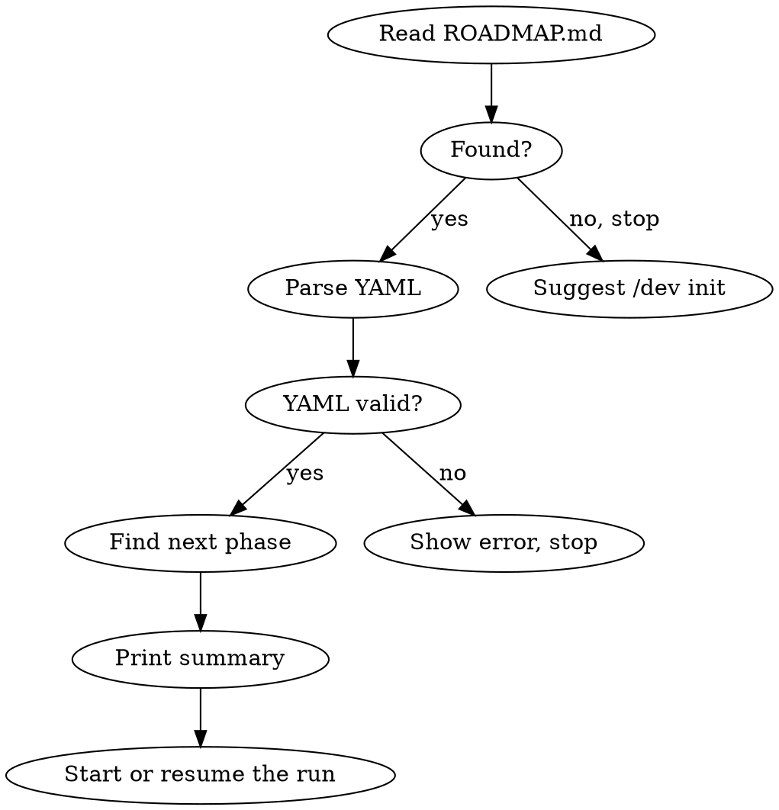
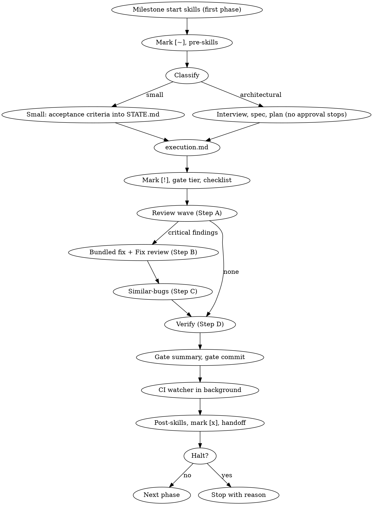

## Language

**IMPORTANT: All user-facing communication MUST be in the user's language** — the language the user writes in, or the language their instructions specify. This includes:
- AskUserQuestion labels, descriptions, and options
- Status summaries and progress reports
- Error messages and warnings
- Commit message bodies (keep conventional commit prefixes in English, e.g. `roadmap:`, `feat:`)
- STATE.md and ROADMAP.md prose sections

Technical terms, skill names, file paths, YAML keys and conventional-commit prefixes stay in English.

---

# /dev — Milestone Orchestrator

Manages a project's ROADMAP.md and runs its phases one after another: clarify, specify, implement,
gate. Implementation and review are delegated to subagents; the main session only steers.

## Command Router

| Input | Section | Read |
|-------|---------|------|
| `/dev` or `/dev next` | Session Start | this file |
| `/dev init` | Roadmap Creation | `roadmap-creation.md` |
| `/dev status` | Status Display | `commands.md` |
| `/dev skip` | Skip Phase | `commands.md` |
| `/dev add` | Add Phase/Milestone | `commands.md` |
| `/dev reorder` | Reorder Phases | `commands.md` |
| `/dev review` | Pre-Release Review | `commands.md` |
| `/dev debug` | Debug Flow | `commands.md` → `debugger.md` |
| `/dev pause` | Pause Session | `commands.md` |
| `/dev check` | Standalone Quality Gate | `dev-check.md` → `gate.md` |
| `/dev ui [scope]` | UI review and rework | `ui-review.md` |
| `/dev updates` | Decide on held-back skill updates | `updates.md` → `sources.md` |

## When NOT to Use

- Single-task requests ("fix this bug", "add a button") — use superpowers directly
- Projects without milestones — overkill for small fixes
- When user explicitly asks to skip the orchestrator

---

## Files of This Skill

`$DEV_DIR` is the directory of this `SKILL.md`; all paths below are relative to it. Load only what
the current step needs.

| File | Holds | Read when |
|---|---|---|
| `execution.md` | How a phase is implemented: small phase, waves of parallel implementers, task reviews, merge | Step 4c; resuming a `[~]` phase with a plan or acceptance criteria |
| `gate.md` | Quality gate: tier, review wave, fix, similar-bugs, verify, gate commit, CI in background; checklist, phase types, `@gate:`, project commands per stack | Gate entry, resuming `[!]`, before each next phase (CI status), `/dev check` |
| `commands.md` | Status, skip, add, reorder, pause, debug, milestone end, pre-release review | The router points there; Milestone End (step 7); build/tests fail without obvious cause (Debug Flow) |
| `models.md` | Which model tier each subagent gets | Before dispatching subagents |
| `state.md` | What STATE.md holds and when each part changes (handoff, decisions, CI lines) | Before writing STATE.md |
| `companion.md` | Visual Companion: when browser vs terminal, mandatory triggers, server start, "Show screen" | Before the first screen of a session |
| `companion-screens.md` | Look and building blocks of the screens | When writing a screen |
| `runtime.md` | Host adapter: `$DEV_DIR`, tool names as capabilities, Codex vs Claude Code | Once per session, at the first explicit `/dev` run (not for the automatic one-line status) |
| `superpowers.md` | Which superpowers install is active, static check, update path (prepares only) | Session start before the first phase step; before any plugin update |
| `befragung.md` | Bundled clarification round at run start; interview in rounds for architectural phases; ADRs | Run start; step 4a, architectural phase |
| `tech-stack-triggers.md` | Which tech, design and security sources fire when | Steps 4a, 4c and gate Step A |
| `roadmap-creation.md`, `dev-check.md`, `e2e-testing.md`, `debugger.md` | One flow each | As named in the router or gate |
| `stack/INDEX.md`, `stack/docs.md` | Stack detection; which stack source or bundled docs load on which trigger; live-docs source per technology | Detection once per session (section 1); otherwise only via `tech-stack-triggers.md` — then only the matching rows |
| `design/INDEX.md` | Which design guideline or source loads on which trigger | Only via `tech-stack-triggers.md`, `ui-review.md`, companion building block "UI decision" — then only the matching rows |
| `analyzers/CONTRACT.md` | How each analyzer subagent is dispatched and reports | With every analyzer dispatch (gate Steps A–C, Milestone End, Pre-Release Review, `/dev ui`) |
| `brag.md` | When the launch video (brag) is offered and how it runs | Milestone End step 7, Pre-Release Review step 6 |
| `ui-review.md` | `/dev ui`: screenshots, design analyses, `UI-REVIEW.md`, rework after approval | `/dev ui` |
| `sources.md`, `updates.md` | Contract per referenced skill (reads, overrides, invariants); `/dev updates` and its queue | `/dev updates`; when adding a use of a foreign skill |

**Visual Companion in one sentence:** it shows only the user interface of the product (mockups, states, real screenshots — never roadmaps, plans, architecture or findings), is used without asking wherever this skill says **"Show screen"** (procedure in `companion.md`), and every message that points the user at a new or updated screen ends with its current URL (status messages without anything new to see carry none).

---

## Tech-Stack-Aware Skills

Detect the project's tech stack once per session and auto-invoke matching skills at the right points in the lifecycle. Detection runs once per session at the first explicit `/dev` run (not for the automatic one-line status), by checking config files and dependencies.

### Detection

**→ Read section 1 of `stack/INDEX.md`** (indicator → stack id) and check the project root against it. Store the ids as `$TECH_STACKS` for the session (e.g., `[nextjs, shadcn, postgres, docker]`). `nextjs`, `shadcn` and `svelte` also count as **web**, `ios` as **Apple** — that is what the `design/INDEX.md` platform rows match on.

### Where Tech Skills Auto-Trigger

**→ Read `tech-stack-triggers.md` in this skill directory for both trigger matrices.**

Summary: Tech skills, stack sources and design sources kick in at three points — during **clarification (4a)**
and **execution (4c)**, depending on `@type:`, the task and `$TECH_STACKS`, and in the **gate's review
wave (Step A)** as read-only reviews, triggered by the files the phase actually changed (*Tech-Stack
Review* and *Security Review* matrices; the list of skills and analyzers lives only there). Critical
findings are fixed in gate Step B.

---

## Session Start

**Triggered by:** `/dev`, `/dev next`, or automatically when a new session starts and ROADMAP.md exists.

**Automatic trigger — one line, nothing else.** When the session starts in a project with ROADMAP.md
and the user has not typed `/dev` or asked to work on the roadmap: read ROADMAP.md (and STATE.md if
present) and print a single line —
`Roadmap: <milestone> — next: Phase N <name> [<state>]. Continue with /dev.` — then turn to what
the user actually asked. If `${DEV_UPDATES_DIR:-$HOME/.claude/dev-updates}/pending/*.json` exist
(count the files, read none), insert `, N skill updates waiting — /dev updates` before the final
period. No companion, no `AskUserQuestion`, no stack detection, no file writes.
The steps below run only on an explicit `/dev` / `/dev next` or a request to work on the roadmap.



1. **Read ROADMAP.md** from project root. If missing: "No ROADMAP.md found. Run `/dev init` to create one." Stop.
2. **Read STATE.md** from project root. If missing: create it from ROADMAP.md (derive progress, position, session info). If present: start from its **Handoff** block and Session Continuity.
3. **Detect tech stack** — check project root for stack indicators (see Tech-Stack-Aware Skills section). Store as `$TECH_STACKS`. This detection happens ONCE per session and is reused in all subsequent gates.
4. **Parse YAML frontmatter.** If malformed: show error, ask user to fix manually, stop.
5. **Parse phases:** Extract milestones (`##`), goals (`Goal:`), phases (checkbox items), annotations (`@type:`, `@skills:`, `@spec:`, `@plan:`, `@gate:`).
   - States: `[ ]` not started, `[~]` in progress, `[!]` gate pending (implementation done, quality gate outstanding), `[x]` done, `[—]` skipped
   - `@gate:` values other than `full` (the old `fast` and `ci-wait`) are ignored with a warning (`gate.md`, "Tier").
6. **Find current position:** First milestone with incomplete phase. If all done: "Roadmap complete!" Offer `/dev add` or `/dev review`.
7. **Show summary** — in the terminal only (the companion is for the user interface, not for roadmaps):
   ```
   Milestone 2: UI Shell (3/5 phases done)
   Next: Phase 4 — Connections View (@type:ui)   [resume: gate, first open item "Spec checker"]
   Tech Stack: [nextjs, shadcn, postgres]
   Blockers: <from STATE.md, if any>
   CI in background: <open lines from STATE.md, if any>
   Updates: N skill updates waiting — /dev updates   (only if pending/ has files; count only)
   ```
   Show `@gate: full` when set. Show `$TECH_STACKS` only on first session start or if changed.
8. **Start the run — no menu.** `/dev` and `/dev next` go straight on: a `[!]` phase resumes the gate
   at the first open checklist item, a `[~]` phase resumes per "Resume logic" (4), otherwise the next
   phase starts. A menu here only ever got the answer "continue". Looking without starting is
   `/dev status`; adding, skipping or reviewing have their own commands.

---

## Roadmap Creation

**Triggered by:** `/dev init`

**→ Read `roadmap-creation.md` in this skill directory for the full interactive flow.**

Summary: Interactive AskUserQuestion flow for project goal, phase types, milestone count, skill discovery + security review, trigger configuration, preview + confirm. Creates ROADMAP.md + STATE.md and commits both.

---

## Skill Trigger Resolution

1. Read `@type:` from phase (e.g., `ui`)
2. Look up `defaults.phase-types.<type>.pre` and `.post` from frontmatter
3. Apply phase overrides:
   - `@skills:+pre[a]` → append to pre defaults
   - `@skills:+post[a]` → append to post defaults
   - `@skills:pre[a]` (no `+`) → replace pre defaults
   - `@skills:post[a]` (no `+`) → replace post defaults
4. Multiple combine: `@skills:+pre[a] @skills:+post[b]`
5. Unknown type → warn, continue with empty lists

Built-in phase types and the `@gate:` annotation (both shape the gate) are in `gate.md`.

---

## Halt on Irreversible Actions

Across all phase steps: **for anything that `git revert` cannot undo, stop and
ask** — even in the middle of an autonomous run, even if the plan includes the step.

The criterion is not "feels risky", but: *if this was wrong, does a
commit revert restore the state?* If the answer is no, the decision belongs to the user:

- Schema and data migrations, especially destructive ones (`DROP`, `DELETE`, `TRUNCATE`, type changes)
- any change to a **shared** development or staging database — it takes effect immediately
  for all parallel sessions, not only on merge
- Deploys, releases, tags, force-pushes, deleting branches
- outgoing messages to real recipients (mail, push, webhooks) and payment transactions
- Writing to external storage, registries or object storage
- anything that touches secrets, keys or credentials

Procedure: stop, say in one sentence what would happen and what about it cannot be undone,
state the proposal, get approval. For `@type: migration` this halt is mandatory and cannot
be replaced by a line in the plan — a plan that describes the migration is not approval
to run it. An approval must name the action: "looks fine" to another question is none. A deploy
or release approval comes with a rollback plan (trigger, steps, time to restore), stated before asking.

---

## The run

A run works through the phases back to back until the milestone ends or a halt applies. At its
start, ask the bundled clarification round (`befragung.md`, "Bundled round at run start"). **The run
halts only for:**

- clarification questions only the user can answer (`befragung.md`);
- irreversible actions (section above);
- a gate still red after 3 fix rounds, or a task still open after its 3 fix rounds (`execution.md`);
- the context hint (below);
- Milestone End (`commands.md`);
- plus the gate's own stops (`gate.md`): wrong branch at the gate commit, unclear staging, no
  authorized route for CI, a review item that timed out twice.

CI `red` or `timeout` = halt to repair (`gate.md`), then the run continues; `none` is no halt but
never green and is noted in the gate summary.

Everything else goes on without asking: no spec or plan approval, no "continue?" between steps or
phases. Measured over eight runs, 25–78 % of the wall clock was waiting for the user, mostly before
a plain "continue" that decided nothing (one run: 11 pauses, 361 minutes). Whoever wants to follow along reads the spec, the plan and
STATE.md; each phase ends with one status line in the chat.

**Context hint.** After each phase: if this session has completed 3 phases, or the host shows the
context above ~250k tokens, stop at the phase boundary with "Context is large — `/clear`, then
`/dev next`; the handoff is in STATE.md." A large context is reread on every turn and was the
biggest single cost. Both values are starting points, to be remeasured after the first runs.

---

## Phase Execution



### 1. Milestone Start Check

First phase of new milestone → run `defaults.skills.milestone-start` as parallel Agent subagents. Missing skills → warn and skip.

### 2. Pre-Phase

1. **CI status first:** read every open line under `## CI in background` (`gate.md`). `red` or
   `timeout` → halt and repair before this phase starts.
2. Mark phase `[~]` in ROADMAP.md (Edit tool)
3. Resolve pre-skills (see Skill Trigger Resolution)
4. Dispatch pre-skills as parallel Agent subagents

### 3. Pre-Skill Handoff

If pre-skills produced output files (e.g. a handoff file in a dot-directory of the project), pass their paths as context to step 4a and read only the relevant findings.

### 4. Phase Cycle

**Resume logic:**
- Phase is `[!]` → skip directly to Quality Gate (step 5), read Gate Checklist from STATE.md to find remaining steps
- Phase is `[~]` with `@plan:` path on disk, or acceptance criteria ending in `Criteria complete.` (small phase) → execution (4c); the ledger says which tasks are done (`execution.md`, "Ledger")
- Phase is `[~]` with `@spec:` path on disk → planning (4b)
- STATE.md has `## UI review — approved findings` → those IDs are part of this phase: fix each to its criterion in `UI-REVIEW.md`, then clear it (`state.md`)
- Phase is `[~]` with neither, or with criteria lacking that last line → clarification (4a)

**4a. Clarification:**
1. **Classify:** architectural if the phase creates a new project or subsystem, changes how components interact, or changes interfaces that others build on; `@type: migration` always. When in doubt, architectural. For `@type: docs`, no interview.
2. **Small → write the draft straight into STATE.md** under the phase as `Acceptance criteria:`
   (format in `state.md`), closed by the line `Criteria complete.` — no approval round; the Spec checker and a resume read it there. Ask only
   questions whose answer changes what gets built, via `AskUserQuestion`, recommendation first with
   "(Recommended)"; look up facts yourself instead of asking.
3. **Architectural → interview in rounds per `befragung.md`** (incl. ADRs), then
   `superpowers:brainstorming` with the handoff note from `befragung.md` **and this override**: no
   section approvals, write and commit the spec, no spec review gate (`sources.md` O14). Its
   hand-off to `writing-plans` carries the 4b instruction. After the spec is committed: add `@spec:`
   to ROADMAP.md.

In both cases, include matching tech skills beforehand (`tech-stack-triggers.md`, "During
Brainstorming"). For questions with a UI/UX side, ensure the companion via the "Show screen"
procedure and pass this instruction along: "The Visual Companion is already running (URL below). Do
not offer it, use it directly for every question with a UI/UX side — and only for those: no plans,
approaches, architecture diagrams or text summaries on screens; building blocks in
`companion-screens.md` of the `/dev` skill. Every message that shows a new or updated screen, or asks
about one, ends with this URL on its own line, verbatim; messages without anything new to see carry
no URL."

**4b. Planning:** `superpowers:writing-plans` with "no execution-method question; do not start
execution — `/dev` does" (`sources.md` O15). Write and commit the plan, add `@plan:` to ROADMAP.md, go on to
4c — no plan approval.

**4c. Execution → read `execution.md`:** small phases from the acceptance criteria, planned phases in
waves of parallel implementers, a task review per task; no branch completion, no whole-branch review.

No separate verification step: gate Step D proves tests, build and E2E on the final state, and its
evidence rules keep the principle (no claim without a command whose output was read).

**4d. Gate Transition (`[~]` → `[!]`):**
1. Mark phase `[!]` in ROADMAP.md (Edit tool)
2. Create the Quality Gate Checklist in STATE.md — tier and format in `gate.md`, "Tier" and "Gate Checklist"
3. Update STATE.md Last activity: "Implementation complete, Quality Gate starting"

The `[!]` status means: implementation is done, but the mandatory Quality Gate has not yet passed. This is the **only** path to `[x]` — a phase MUST go through `[!]` first. Direct `[~]` → `[x]` transitions are **forbidden**.

### 5. Mandatory Quality Gate

**→ Read `gate.md`.** Summary: `gate-tier.py` decides small or large → Step A, one parallel review
wave (Diff review, Spec checker, and per trigger Security, Tech-Stack, Performance, Accessibility,
Design) → Step B, one bundled fix for all critical findings plus a Fix review on the fix diff, at most
3 rounds → Step C, Similar-bugs scan when code was fixed → Step D, typecheck + lint + tests and build
in parallel, then E2E → gate summary → gate commit `[gate-pass]` → CI watcher in background. Every
checkmark needs evidence; the phase stays `[!]` until all are `[x]`.

### 6. Post-Phase

**Pre-condition:** All items in the STATE.md Gate Checklist must be `[x]`. If any are unchecked, return to the first unchecked step and complete it. Do NOT proceed to Post-Phase with an incomplete checklist.

Dispatch post-skills as Agent subagents. **Parallelization:** Read-only analysis skills run in parallel. Skills needing final code state run after analysis completes.

**Note:** every check on the Gate Checklist (`gate.md`) has already run in step 5. Do not run any of them again as post-skills even if listed in `@skills:post[]`.

**The Gate commit has already happened** — post-skills run on the gate-verified code state.

### 7. Phase Completion (`[!]` → `[x]`)

1. **Verify Gate Checklist:** `python3 "$DEV_DIR/scripts/check-evidence.py" check STATE.md` must exit 0 — every Quality Gate item `[x]`, with evidence, on the current state (the gate commit keeps that state). If any unchecked → STOP, return to first unchecked step 5.
2. **CI runs in background;** its status is checked before the next phase (`gate.md`, "CI in background").
3. Mark `[x]` in ROADMAP.md (replacing `[!]`), ensure `@spec:` and `@plan:` present (small phases have neither)
4. **Remove Gate Checklist** from STATE.md (the `## Quality Gate — Phase N` section). **The Gate summary is kept.**
5. **Update STATE.md**: Current Position, Progress table, Last activity, and replace the **Handoff** block (`state.md`); delete the phase's SDD workspace (`execution.md`)
6. Commit: `roadmap: complete Phase N — <name>`
7. All phases done in milestone? → Milestone End (`commands.md`); it waits for every open CI line

### 8. Next Action

Print one status line for the phase, then continue with the next phase — unless a halt from "The
run" applies, the context hint included.

---

## Phase Interruption

**Triggered by:** User says "drop it", "do something else", "stop", "cancel" or similar during an active `[~]` or `[!]` phase.

**Behavior:**
1. **Stop current work immediately.** Do not continue the current skill invocation; stop running background implementers (TaskStop or the host's stop) and record each as `interrupted` in the ledger (`execution.md`).
2. **AskUserQuestion** (single-select):
   - **Pause phase** (Recommended) — save progress in STATE.md, keep phase `[~]`/`[!]`, resume later with `/dev next`
   - **Skip phase** — mark `[—]` with reason, move to next phase
   - **Do something else** — pause via STATE.md, then handle the user's new request outside `/dev`
3. For "Pause phase" and "Do something else": update STATE.md Session Continuity with what was in progress (e.g., "Phase 3 — interrupted after brainstorming, plan still pending").
4. For "Do something else": do NOT automatically resume the phase after the side task — the user must explicitly say `/dev` or `/dev next` to resume.

**Key rule:** Interruptions preserve state. No work is lost. The `[~]`/`[!]` status and any Gate Checklist items already checked remain intact.

---

## Error Handling

| Scenario | Behavior |
|----------|----------|
| ROADMAP.md missing | Suggest `/dev init`. Stop. |
| YAML malformed | Show error. Stop. |
| Phase `[!]` found | Resume Quality Gate — read STATE.md checklist, continue from first unchecked item. |
| Phase `[~]` found | Resume per "Resume logic" (spec, plan, acceptance criteria, ledger). |
| Phase `[—]` found | Skip in sequencing, show reason on status. |
| All phases done in MS | Auto-trigger Milestone End. |
| All milestones done | "Roadmap complete!" Offer add/review. |
| CI status `red` or `timeout` | Halt to repair before the next phase (`gate.md`, "CI in background"), then the run continues. `none` → not a halt, never green, noted in the gate summary. |
| `/dev check` with active phase `[~]`/`[!]` | Warn: "Phase N still active. Use `/dev next`." Stop. |
| `/dev check` + empty `$CHECK_SCOPE` + No | Not an error — the user cancelled. Stop without action. |
| `/dev check` + a step fails | Stop at that step, no check commit. |
| `/dev ui` with active phase `[~]`/`[!]` | Analyse and get approval only; the rework belongs to that phase (`ui-review.md`). |

**Principle:** Never block for recoverable errors (unknown `@type:`, a skill not installed, an `@skills` parse error): warn and continue with empty or default lists. Stop only for missing ROADMAP.md, broken YAML and the halts in "The run".
