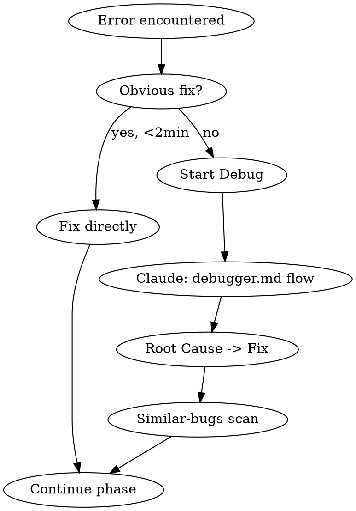

# /dev — commands besides the phase loop

Read when the router in `SKILL.md` points here. The phase loop itself (Session Start, Phase
Execution) stays in `SKILL.md`; the gate is in `gate.md`.

## Status Display

**Triggered by:** `/dev status` or "Show full status"

1. **Read STATE.md** — show Blockers & Risks (if any) and Session Continuity at the top.
2. **Show full roadmap — Show screen** (procedure in `companion.md`). Content: building block "Roadmap" (`companion-screens.md`) — all milestones, all phases with status icons, spec/plan links, blockers in red at the top. Additionally a short terminal form:
   ```
   ### Blockers
   - Windows Dashboard: placeholder only

   ### Milestone 1: Foundation (3/3) — Complete
   | # | Phase | Type | Status | Spec | Plan |
   |---|-------|------|--------|------|------|
   | 1 | Database Layer | backend | done | [spec] | [plan] |

   ### Milestone 2: UI Shell (1/3)
   | 1 | Navigation | ui | done | [spec] | [plan] |
   | 2 | Connections View | ui | next | — | — |
   | 3 | Dashboard | ui | pending | — | — |

   ### Requirements: 26/30 complete
   ### Last session: 2026-03-20 — Stopped at: ROADMAP consolidated
   ```
3. **Update STATE.md** Session Continuity with current timestamp.

After display: AskUserQuestion with Start/Add/Skip/Done options.

---

---

## Milestone End

All phases `[x]` or `[—]`:

1. **Run `defaults.skills.milestone-end`** as parallel agents (if configured).
2. **Mandatory Parallel Block** — dispatch as parallel Agent subagents, each with `analyzers/CONTRACT.md` + its analyzer file (**model explicit: capable tier for full scans**, see "Subagent Model Choice" in `gate.md`), wait for all to complete:
   - **Bug hunt** (full mode) — deep analysis of the entire milestone scope through all 7 lenses.
   - **Performance review** (full mode) — comprehensive performance anti-pattern scan across the milestone's changes.
   - **Security review** (full mode) — complete security scan of the entire milestone scope. Even if every phase already had conditional security audits, full mode uncovers cross-cutting attack surfaces (interplay of several components, cumulative risks).
   - Critical findings from all three: fix before proceeding.
   - Non-critical findings: note in STATE.md under Blockers & Risks.
3. **Mandatory: Dead-code scan** (`analyzers/dead-code.md`, quick mode) — scans for unused code accumulated across the milestone's phases. Hardcoded, runs regardless of configuration.
   - If dead code is found: show findings, fix automatically where safe (unused imports, unreferenced functions), ask for confirmation on larger removals.
4. Re-run typecheck + lint (`gate.md`, "Project Commands per Stack") after any fixes from steps 2–3.
5. **Update STATE.md** (Progress table, Current Position to next milestone).
6. **Show summary — Show screen** (procedure in `companion.md`). Content: building blocks "Roadmap" + "Gate dashboard" (`companion-screens.md`) — completed phases with Gate summary highlights (critical findings/fixes), next steps, milestone name + goal prominently at the top.
7. AskUserQuestion: Next milestone (Recommended), Pre-release review (if configured), Pause.

---

---

## Pause Session

**Triggered by:** `/dev pause`

Explicitly saves session state for clean handoff to next conversation.

1. **Update STATE.md** Session Continuity:
   - `Last session`: today's date
   - `Stopped at`: current phase name + what was in progress (e.g., "Phase 6 Dashboard — brainstorming complete, plan pending")
   - `Resume`: specific next action (e.g., "`/dev next` to continue planning Phase 6")
2. **Clean up the Visual Companion** (if the server is active):
   - Push a waiting screen: `<div style="display:flex;align-items:center;justify-content:center;min-height:60vh"><p class="subtitle">Session paused — continue with /dev</p></div>`
   - Then stop the server: `~/.claude/skills/dev/scripts/companion-stop.sh <session_dir>`
3. Show confirmation: "Session saved. Next time, run `/dev` to resume."

---

---

## Debug Flow

**Triggered by:**
- `/dev debug` or `/dev debug <description>` — explicit user request
- User says "fix crash", "why is this broken", "not working", "find bug"
- **Automatically during Phase Execution** when:
  - Build fails and the error is not a simple typo or missing import (i.e., requires investigation)
  - Tests fail after implementation and the cause is not immediately obvious
  - App crashes during `build-and-run`
  - A verification step reveals unexpected behavior

**When NOT to use debug flow:**
- Compiler error with obvious fix (missing semicolon, typo, wrong type) → just fix it
- Build failure due to missing dependency → just add it
- Test fails because test expectations need updating → just update
- If the fix is obvious within 2 minutes, skip the debug flow



Read and follow `debugger.md` in this skill directory for the Claude-side flow. It implements scientific debugging with persistent state files in `.debug/`, a knowledge base that learns from past bugs, and session resume capability.

Key integration points:
- Debug files record which `/dev` phase was active (if any)
- After fix: Similar-bugs scan runs automatically
- After archive: returns to the `[~]` phase if one was in progress
- Knowledge base (`.debug/knowledge-base.md`) accelerates future debugging

---

---

## Skip Phase

**Triggered by:** `/dev skip`

1. Show phase to skip. AskUserQuestion: Skip with reason (Other for free text), Cancel.
2. Update ROADMAP.md: `[—]` + `<!-- skipped: <reason> -->`
3. **Update STATE.md**: Current Position, Progress table, Last activity.
4. Commit.
5. **Show screen** — updated roadmap (building block "Roadmap" in `companion-screens.md`), with the skipped phase marked with the `[—]` icon and the reason.
6. Return to Session Start.

---

## Add Phase/Milestone

**Triggered by:** `/dev add`

AskUserQuestion: Add phase (Recommended) or Add milestone.

**Phase:** Which milestone → name → type → position (end or after specific phase) → extra skills → Edit ROADMAP.md → commit.
**Milestone:** Name/goal → phases → append to ROADMAP.md → commit.

After the commit: **Show screen** — updated roadmap (building block "Roadmap" in `companion-screens.md`), with the new phase/milestone highlighted with a "new" badge.

Warn if adding to a completed milestone.

---

## Reorder Phases

**Triggered by:** `/dev reorder`

Only `[ ]` phases can move. `[x]`, `[!]`, `[~]`, `[—]` stay. If <2 movable: "Nothing to reorder." AskUserQuestion: which phase → which position → Edit → commit.

After the commit: **Show screen** — updated roadmap (building block "Roadmap" in `companion-screens.md`), with the moved phase shown in its new position with a "moved" badge.

---

---

## Pre-Release Review

**Triggered by:** `/dev review`

1. **Mandatory Parallel Block** — dispatch as parallel Agent subagents, each with `analyzers/CONTRACT.md` + its analyzer file (**model explicit: capable tier**, see "Subagent Model Choice" in `gate.md`):
   - **Bug hunt** (full mode) — entire codebase, 7 lenses.
   - **Performance review** (full mode) — entire codebase.
   - **Security review** (full mode) — entire codebase. Critical — must be green before release.
   - Critical findings from all three: fix before proceeding. Non-critical: note in STATE.md.
2. **Mandatory: Dead-code scan** (`analyzers/dead-code.md`, full mode) — comprehensive scan of the entire codebase. Fix findings, then re-run typecheck + lint (`gate.md`, "Project Commands per Stack").
3. **Read Gate summaries** — read all `### Gate summary` entries from STATE.md. If there are none (first release or fresh project): output the note "No gate history available — this is the first release", skip this step. If present: show a consolidated quality picture: which findings were found and fixed across all phases? Are there recurring patterns?
4. Read `defaults.skills.pre-release`. Run each configured skill **sequentially** (each may change code):
   - Dispatch Agent subagent → wait → show summary → AskUserQuestion: Continue (Recommended) or Pause
5. Final summary after all skills.

---

---

## Standalone Quality Gate

**Triggered by:** `/dev check`

**→ Read `dev-check.md` in this skill directory for the full flow.**

Summary: Precondition is **no active phase** (`[~]`/`[!]` → stop, point to `/dev next`).
Snapshot of the changed files as an immutable `$CHECK_SCOPE`, then the same steps
5a–5k as the phase gate against that scope, Check summary in STATE.md, check commit
`chore: dev check [gate-pass]`.
